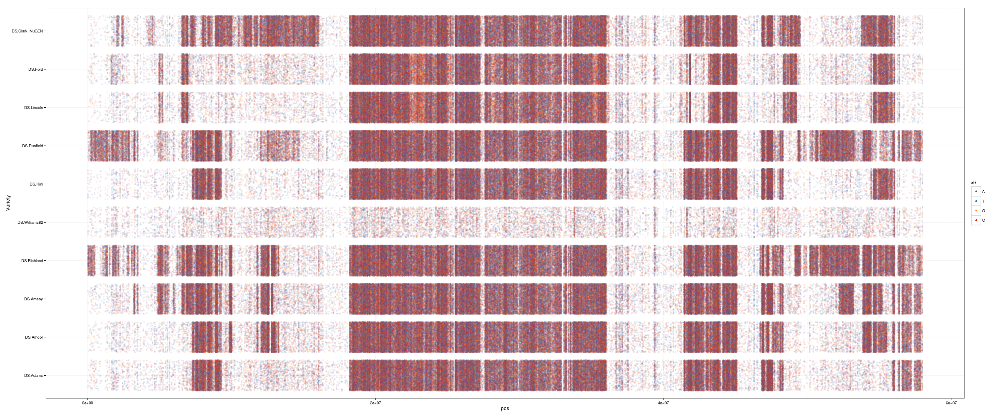
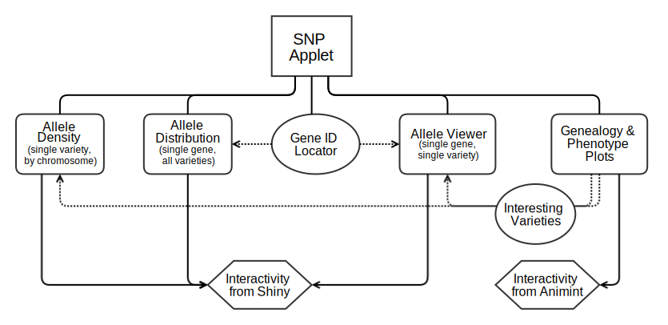
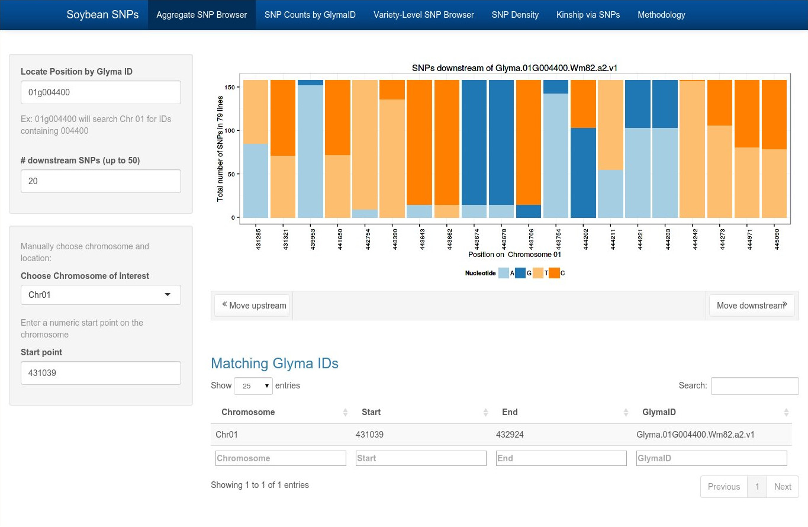
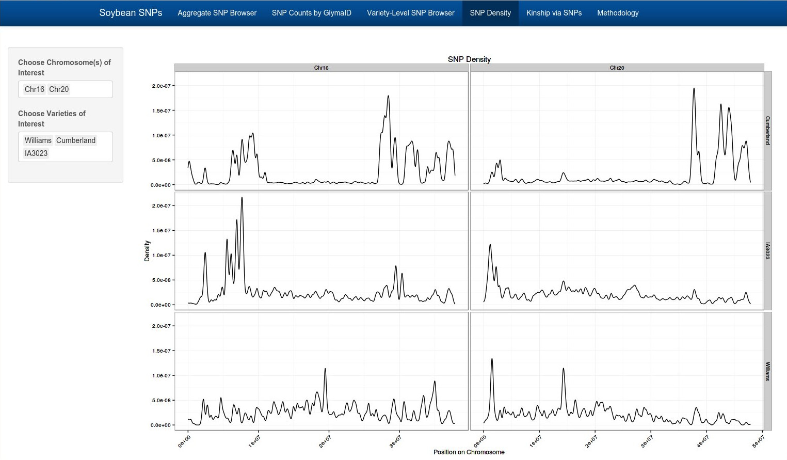
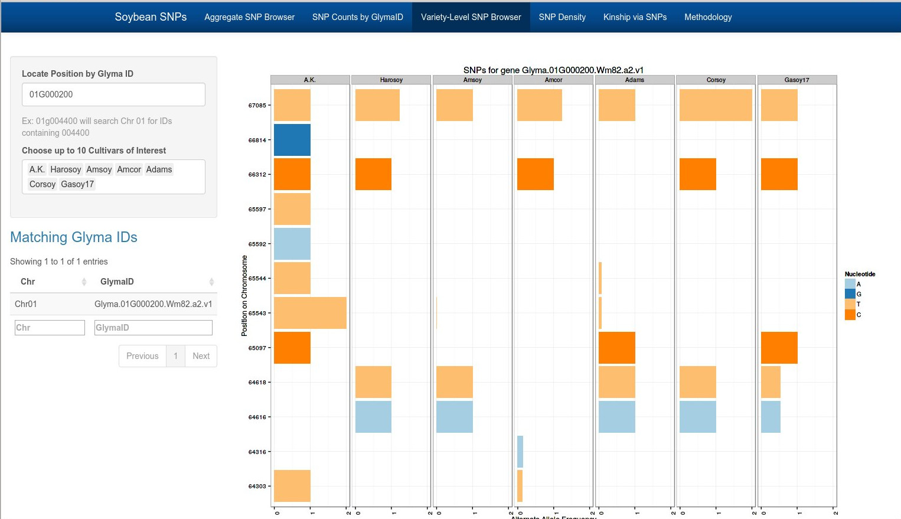
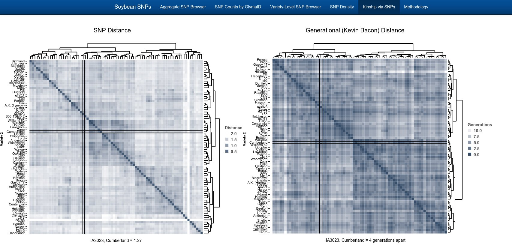
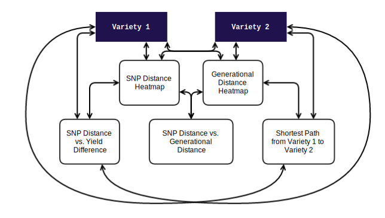

```{r setup, fig.keep='all',echo=FALSE, eval=TRUE, error=FALSE, warning=FALSE, message=FALSE}
options(replace.assign=TRUE,width=70)
library(knitr)
library(ggplot2)
library(reshape2)
library(plyr)
library(gridExtra)

opts_chunk$set(fig.path='figure/fig-', cache.path='cache/', fig.align='center', fig.width=5, fig.height=5, fig.show='hold', par=TRUE, cache=TRUE, concordance=TRUE, autodep=TRUE, warning=FALSE, message=FALSE, echo=FALSE)


```

## Outline
<br><div align="left">
<ul>
<li style="margin:1em;"> Introduction</li>
<li style="margin:1em;"> Statistical Graphics and Big Data </li>
<li style="margin:1em;"> Case Study: Designing Interactive Graphics for Soybean Population Genetic Analysis</li>
</ul>
</div>

# Introduction {.title}

## About Me
<table style="border:0px">
<tr style="padding:10px;border:0px;">
<td style="border:0px;vertical-align:middle;align:left;font-size:1.25em;" width='75%' >
PhD in Statistics (2015*)  
<br></br>  
MS in Statistics (2011)
</td>
<td style="border:0px;vertical-align:middle;align:center;" width='25%'>

</td>
</tr>
<tr style="padding:10px;border:0px;">
<td style="border:0px;vertical-align:middle;align:left;font-size:1.25em;" width='75%'>
BS in Applied Mathematical Sciences and Cognitive Psychology (2009)
</td>
<td style="border:0px;vertical-align:middle;align:center;" width='25%'>

</td>
</tr>
</table>


## Statistical Interests

<ul style="margin-bottom:20px;margin-top:10px;width:50%;">
<li style="text-align:left;margin-bottom:20px;margin-top=10px;">Modeling</li>
<li style="text-align:left;margin-bottom:20px;margin-top=10px;">Bayesian statistics</li>
<li style="text-align:left;margin-bottom:20px;margin-top=10px;">Data mining</li>
<li style="text-align:left;margin-bottom:20px;margin-top=10px;">Visualization</li>
<li style="text-align:left;margin-bottom:20px;margin-top=10px;">Simulation</li>
<li style="text-align:left;margin-bottom:20px;margin-top=10px;">Nonparametric statisics</li>
<li style="text-align:left;margin-bottom:20px;margin-top=10px;">Engineering statistics</li>
</ul>

## Research and Collaborations

<ul style="margin-bottom:20px;margin-top:10px;width:95%;">
<li style="text-align:left;margin-bottom:30px;margin-top=10px;">
Modeling material structure and composition  
<p style="font-size:.9em;"><i>Robust nonparametric statistics for Atom Probe Tomography Spectra</i></p>  
(MS research, with ISU Material Science & Engineering)</li>
<li style="text-align:left;margin-bottom:30px;margin-top=20px;">Evaluating road safety (with Iowa Dept. of Transportation)</li>
<li style="text-align:left;margin-bottom:30px;margin-top=20px;">Exploring perception of statistical graphics (PhD research)</li>
<li style="text-align:left;margin-bottom:20px;margin-top=20px;">Analysis of soybean genomics (with USDA)</li>
</ul>

## Statistical Philosophy
<ul>
<li class="fragment" style="margin:1em"> Understand the dataset through exploratory analysis
  <ul>
    <li>Graphical summaries</li>
    <li>Summary statistics</li>
    <li>Identify record errors, data artifacts, other issues that may affect modeling</li>
  </ul>
</li>
<li class="fragment" style="margin:1em">Model the data appropriately</li>
<li class="fragment" style="margin:1em">Communicate model results and implications clearly
  <ul>
    <li>Well-designed graphics</li>
    <li>Simulated model predictions to make model less abstract</li>
  </ul>
</li>
</ul>
# Statistical Graphics and Big Data {.title}

## Good Statistical Graphics

<div style="text-align:left;margin-left:20%;">

**Function:**  

- Show the data
- Don't distort the data  
<br>  

**Form:**  

- Show a consistent story
- Provide several levels of detail

<div align="center" style="padding:10px">(Ideally)</div>  

**Elegance:**  
How do I best communicate the data?  

- Perceptual Awareness
- Visual Bandwidth (information overload)
</div>

## Big Data

Visualization is an important tool for working with big data  
<br></br>

<h3 style="text-align:left">Graphical adaptations for big data:  </h3>

- Overplotting (large $n$)
- High-dimensional data (large $p$)
- Distributed/multi-source data, hierarchical data
- No solution (binning, dimension reduction, interactive tour) works for every situation

## Interactive Graphics  
  
- Provide additional information in response to user action  
<br>
- Simultaneously show more than 2-3 variables and their relationship (multiple linked plots)  
<br>
- Accommodate complex data structures  
<br>

BUT...  
<br>
Web-based interactive graphics may be even more size-sensitive than static graphics. 


# Interactive Visualization of Soybean Population Genetic Data {.title}

---


---

## Overall Project Goals: 
- Understand historical yield increases  
<small>100% increase in past 100 years; additional 70% increase by 2050 to meet food needs (World Bank)</small>  
- Associate genetic features with phenotypic traits 
<small>Disease resistance, yield, nutritional content, time to maturity</small>  

- Communicate analysis results intuitively:
    - Target: Soybean farmers, plant geneticists
    - Provide full results (tables) and graphical summaries
    - Interface with existing databases and web resources

## Data
<br>  

- Sequencing Data (79 varieties, 75GB processed and compressed)  
  <br>
- Field Trials (168 varieties, 30 varieties with genetic data)  
  <br>
- New crosses with highest yield varieties  
<small>(sequencing + field trials)</small>  
  <br>
- Genealogy as reported in the breeding literature (1600 varieties)  

## Visualizing SNPs:  
<ul>
<li class="fragment" style="margin:.5em"> Huge number of interesting genes (70 million ID'd SNPs)  
</li>
</ul>

## Visualizing SNPs:  
<ul>
<li style="margin:.5em"> Huge number of interesting genes (70 million ID'd SNPs)</li>
<li style="margin:.5em"> 79 varieties, 20 chromosomes</li>
<li class="fragment" style="margin:.5em"> Phenotype and genealogy information</li>
<li class="fragment" style="margin:.5em"> Researchers tend to work on gene subsets:<br>
Must be able to zoom and filter</li>
<li class="fragment" style="margin:.5em"> Optimized files for SNP results are still large (10 GB) and require significant computational resources</li>
</ul>  

<p class="fragment" style="margin-top:1em;">Above all, need an interface to allow people to pull new discoveries from the data systematically. </p>


## Visualizing SNPs

<ul>
<li style="margin:.5em"> SNP: Single Nucleotide Polymorphism, a single basepair mutation  
(A -> T, G -> A, C -> G)</li>
<li class="fragment" style="margin:.5em"> [Shiny](www.shiny.rstudio.com) applet: Responsive applet for user-directed data subsets</li>
<li class="fragment" style="margin:.5em"> Show multiple levels of detail (less detail = lower computational load)</li>
<li class="fragment" style="margin:.5em"> Provide resources in the applet for user exploration (not just a reference tool)</li>
</ul>

## Applet Design

<a href="http://localhost:3838/SNP/"></a>

---

### SNP Population Distribution 



---

### Density of SNPs: Chromosome Level



---

### Individual SNPs: Comparing Varieties



---

### Genealogy and Phenotypes

<a href="/storage/Rprojects/USDAsoybeans/Shiny/SNP/www/animint/index.html">Link</a>




---

## Interactive Plot Design



## Good Statistical Graphics

<div style="color:#808080;text-align:left;margin-left:20%;">

**Function:**  

- Show the data
- Don't distort the data  
<br>  

**Form:**  

- Show a consistent story
- Provide several levels of detail
</div>
<div style="text-align:left;margin-left:20%;">
<div align="center" style="padding:10px">(Ideally)</div>  

**Elegance:**  
How do I best communicate the data?  

- Perceptual Awareness
- Visual Bandwidth (information overload)

</div>

## Conclusions {.title}

- Design of graphics informs our ability to work with data
- Well designed graphics facilitate further exploration of the data
- Graphics for high dimensional data may require interactive graphics to 


# Other Projects {.title}

---

- [Animint](https://github.com/tdhock/animint) - Create web-ready interactive graphics and dashboards within R, using ggplot2 and d3.js    
<br></br> 
- Dissertation Research
    - Illusions affecting perception of variability in statistical plots    
        <div style="font-size:.75em;">(2014 ASA Student paper award)</div>
    - Reading statistical graphics: what visual skills are required?
    - Effect of graphical features (color, shape) on ability to identify "significant" graphs
    <br></br>
    
---

- Consulting
    - Shiny applets and dashboards for interactive data display
    - Statistics for power plant reliability    
<br></br> 
- Web scraping and data aggregation
    - Craigslist ads
    - OkCupid
    - Location-based energy prices    
    - Welder economics: features, utility, and prices
<br></br>

## Summary

<ul>
<li style="margin:1em">  Visualization research is inherently interdisciplinary</li>
<li style="margin:1em">  Statistical graphics makes unique contributions to visualizing large data sets</li>
<li style="margin:1em">  Statistical graphics are important to communicate statistical results to non-statisticians</li>
</ul>

---

---

## Acknowledgements 

### Computation
- dplyr/plyr
- reshape2/tidyr
- CN.MOPS: CNV identification in populations of genetic data

## Acknowledgements 

### Visualization Software
- ggplot2
- Animint  
<small>d3 interactive web graphics using ggplot2 syntax in R</small>
- Shiny (RStudio) interactive web applets
- Reveal.js (slides) with Rmarkdown and knitr
