```{r setup, fig.keep='all',echo=FALSE, eval=TRUE, error=FALSE, warning=FALSE, message=FALSE}
options(replace.assign=TRUE,width=70)
library(knitr)
library(ggplot2)
library(reshape2)
library(plyr)
library(gridExtra)

opts_chunk$set(fig.path='figure/fig-', cache.path='cache/', fig.align='center', fig.width=5, fig.height=5, fig.show='hold', par=TRUE, cache=TRUE, concordance=TRUE, autodep=TRUE, warning=FALSE, message=FALSE, echo=FALSE)


```

## Does this data have homogeneous variance?
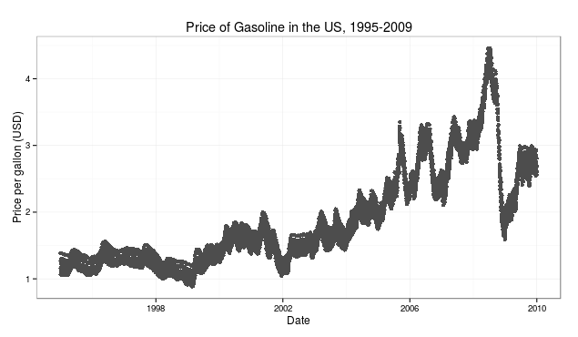  

## Outline
<br><div align="left">
<ul>
<li style="margin:1em;"> Statistical Graphics</li>
<li style="margin:1em;"> Big Data Challenges and Graphics </li>
<li style="margin:1em;"> Case Study: Designing Interactive Graphics for Soybean Population Genetics </li>
<li style="margin:1em;"> Next Steps </li>
</ul>
</div>


# Statistical Graphics {.title}

## Good Statistical Graphics

<div style="text-align:left;margin-left:20%;">

**Function:**  

- Show the data
- Don't distort the data  
<br>  

**Form:**  

- Show a consistent story
- Provide several levels of detail

<div align="center" style="padding:10px">(Ideally)</div>  

**Elegance:**  
How do I best communicate the data?  

- Perceptual Awareness
- Visual Bandwidth (information overload)
</div>
 
---

<h2 style="width:100%;font-size:1.75em;">Statistical Graphics Literature</h2>

<h4 style="text-align:left;margin-bottom:2px;margin-top:5px;">History of Graph Criticism:</h4>
<ul style="margin-bottom:20px;margin-top:10px;width:95%;">
<li style="font-size:70%;text-align:left;">KW Haemer, The American Statistician  
["Double Scales are Dangerous"](http://www.tandfonline.com/doi/pdf/10.1080/00031305.1948.10501588) (1948)  
["The Pseudo Third Dimension"](http://amstat.tandfonline.com/doi/pdf/10.1080/00031305.1951.10501121) (1951)  
["Presentation Problems: Color in Chart Presentation"](http://www.tandfonline.com/doi/pdf/10.1080/00031305.1950.10501632)(1950)
</li>
</ul>

<h4 style="text-align:left;margin-bottom:2px;margin-top:5px;">Examples of Good Graphics:</h4>
<ul style="margin-bottom:20px;margin-top:10px;width:95%%;">
<li style="font-size:70%;text-align:left;">Naomi Robbins ([_Creating More Effective Graphs_](http://www.amazon.com/gp/product/0985911123/))</li>
<li style="font-size:70%;text-align:left;">Howard Wainer ([_Graphic Discovery_](http://www.amazon.com/Graphic-Discovery-Trout-Visual-Adventures/dp/0691134057/))</li>
</ul>

<h4 style="text-align:left;margin-bottom:2px;margin-top:5px;">Guidelines for Creating Good Graphs:</h4>
<ul style="margin-bottom:20px;margin-top:10px;width:95%;">
<li style="font-size:70%;text-align:left;">[Edward Tufte](http://books.google.com/books/about/The_Visual_Display_of_Quantitative_Infor.html?id=v2x4nQEACAAJ) (_[The Visual Display of Quantitative Information](http://www.edwardtufte.com/tufte/books\_vdqi)_)</li>
</ul>

---

<h2 style="width:100%;font-size:1.75em;">Statistical Graphics Literature</h2>

<h4 style="text-align:left;margin-bottom:2px;margin-top:5px;">Ranking of Simple Graphical Tasks</h4>
<ul style="margin-bottom:20px;margin-top:10px;width:95%;">
<li style="font-size:80%;text-align:left;">Cleveland & McGill
<p style="font-size:95%;">
[Graphical Perception: Theory, Experimentation, and Application to the Development of Graphical Methods.](http://www.cs.ubc.ca/~tmm/courses/cpsc533c-04-spr/readings/cleveland.pdf) (1984)  
Additional Papers in 1985, 1987</p></li>
<li style="font-size:80%;text-align:left;"> Heer & Bostock (2010) [Crowdsourcing graphical perception: using mechanical turk to assess visualization design](http://dl.acm.org/citation.cfm?id=1753357)
</ul>
<h4 style="text-align:left;margin-bottom:2px;margin-top:5px;">Visual Inference</h4>
<ul style="margin-bottom:20px;margin-top:10px;width:95%;">
<li style="font-size:80%;text-align:left;"> Statistical Lineups: Evaluating graphics with a hypothesis-testing framework
<p style="font-size:95%;">
Buja et al. (2009) [Statistical inference for exploratory data analysis and model diagnostics](http://rsta.royalsocietypublishing.org/content/367/1906/4361.short)  
Hofmann et al. (2012) [Graphical Tests for the Power of Competing Designs](http://ieeexplore.ieee.org/xpls/abs_all.jsp?arnumber=6327249)  
Majumder et al. (2013) [Validation of Visual Statistical Inference, Applied to Linear Models](http://www.tandfonline.com/doi/abs/10.1080/01621459.2013.808157) 
</p>
</li>

## Dissertation

<ul style="margin-bottom:20px;margin-top:10px;width:95%;">
<li style="text-align:left;margin-bottom:20px;margin-top=10px;">Data Distortion:  
Perceptual illusions that distort statistical charts</li>
  <ul style="margin-bottom:20px;margin-top:10px;width:95%;">
  <li style="text-align:left;font-size:80%"> [Signs of the Sine Illusion: Why We Need to Care (JCGS, 2015)](http://amstat.tandfonline.com/doi/abs/10.1080/10618600.2014.951547)</li>
  <li style="text-align:left;font-size:80%"> [The Curse of Three Dimensions: Why Your Brain is Lying To You (ASA Student Paper Award, 2014)](https://raw.githubusercontent.com/srvanderplas/LieFactorSine/master/GraphicsPaperCompetition/Full%20Paper%20Unblinded.pdf)</li>
  </ul>
<li style="text-align:left;margin-bottom:20px;margin-top=10px;">Visual Inference: Exploring the link between statistical graphics and visual ability </li>
  <ul style="margin-bottom:20px;margin-top:10px;width:95%;">
  <li style="text-align:left;font-size:80%"> [Manuscript in preparation for submission](https://github.com/srvanderplas/VisualAptitude)</li>
  </ul>
<li style="text-align:left;margin-bottom:20px;margin-top=10px;">Perception of Multiple Data Features:  
<p style="font-size:80%">How the mapping between data and graphical features affects the hierarchy of graphical perception and feature recognition.</p></li>
  <ul style="margin-bottom:20px;margin-top:10px;width:95%;">
  <li style="text-align:left;font-size:80%"> [Manuscript in preparation for submission](https://github.com/srvanderplas/Feature Hierarchy)</li>
  </ul>
</ul>


---

### Do any of these plots have homogeneous variance?

```{r sineillusiondatademo, include=F, fig.width=6, fig.height=4.5}
source("code/functions.r")
f <- function(x) 2*sin(x)
fprime <- function(x) 2*cos(x)
f2prime <- function(x) -2*sin(x)
orig <- createSine(40, 1, f, fprime, f2prime, 0, 2*pi)
lims <- getYlim(c(-.33, 1.33), orig, f, fprime, f2prime)
w <- c(-.33, 0, .33, .66, 1, 1.33)
frameorder <- c(3, 6, 1, 2, 4, 5)

data <- rbind.fill(ldply(w, function(i) weightYTrans(orig, i)))
data$set <- sapply(data$w, function(i) which(w %in% i))
data$display <- sapply(data$set, function(i) which(frameorder %in% i))
data2 <- ldply(1:nrow(data), function(i){
  df <- data[i,]
  return(data.frame(x=df$x, y=runif(15, df$ystart, df$yend), ymean=df$y, w=df$w, set=df$set, display=df$display))
})

qplot(data=data2, x=x, y=y, geom="jitter", shape=I(1)) + 
  facet_wrap(~display) + 
  coord_equal(ratio=1) + theme_stimuli() + 
  xlim(lims$dx) + ylim(lims$dy)

qplot(data=data2, x=x, y=y-ymean, geom="jitter", shape=I(1)) + 
#   geom_line(aes(x=x, y=ymean), colour="blue") + 
  facet_wrap(~display) + 
  coord_equal(ratio=1) + theme_stimuli() + 
  xlim(lims$dx) + ylim(lims$dy)

```
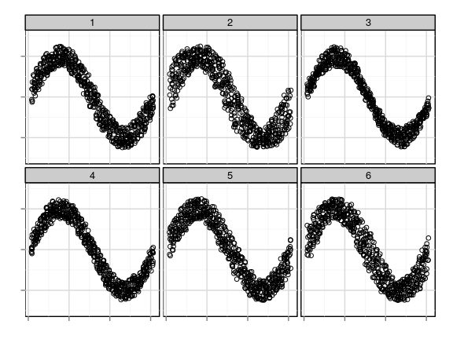
<p style="color:#add9e4;">4</p>

---

### Do any of these plots have homogeneous variance?

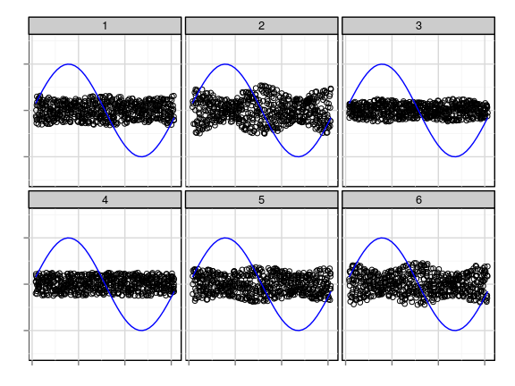

---

## Sine Illusion

```{r sineillusion,fig.width=4, fig.height=3, include=F}

createSine <- function(n=200, len=1, f=f, fprime=fprime, f2prime=f2prime, a=0, b=2*pi) {
  x <- seq(a, b, length=n+2)[(2:(n+1))]
  ell <- rep(len, length=length(x))
  fx <- f(x)
  ystart <- fx - .5*ell
  yend <- fx + .5*ell
  
  # now correct for line illusion in vertical direction
  dy <- diff(range(fx))
  dx <- diff(range(x))
  # fprime works in framework of dx and dy, but we represent it in framework of dx and dy+len
  # needs to be fixed by factor a:  
  a <- dy/(dy + len) 
  # ellx is based on the "trig" correction
  ellx <- ell / cos(atan(abs(a*fprime(x))))
  # ellx2 is based on linear approximation of f  
  ellx2 <- ell * sqrt(1 + a^2*fprime(x)^2)
  
  # make this a data frame - ggplot2 doesn't do well with floating vectors
  dframe <- data.frame(x=x, xstart=x, xend=x, y=fx, ystart=ystart, yend=yend, ell=ell, ellx = ellx, ellx2=ellx2)
  
  # third adjustment is based on quadratic approximation of f.
  # this needs two parts: correction above and below f(x)  
  
  fp <- a*fprime(x)
  f2p <- a*f2prime(x)
  lambdap <- (sqrt((fp^2+1)^2-f2p*fp^2*ell) + fp^2 + 1)^-1    
  lambdam <- -(sqrt((fp^2+1)^2+f2p*fp^2*ell) + fp^2 + 1)^-1    
  
  
  dframe$ellx4.l <- (4*abs(lambdap)*sqrt(1+fp^2))^-1
  dframe$ellx4.u <- (4*abs(lambdam)*sqrt(1+fp^2))^-1
  
  dframe
}

f <- function(x) 2*sin(x)
fprime <- function(x) 2*cos(x)
f2prime <- function(x) -2*sin(x)

qplot(x=x, xend=xend, y = ystart, yend=yend, geom="segment", data=createSine(40, 1, f=f, fprime=fprime, f2prime), colour=I("black")) +
  theme(panel.grid.major=element_blank(), panel.background = element_rect(fill = "white", colour = "white"),
        panel.grid.minor=element_blank(), panel.background=element_blank(),
        axis.title = element_blank(), axis.ticks = element_blank(), 
        axis.text = element_blank()) + coord_equal(ratio=1)

```
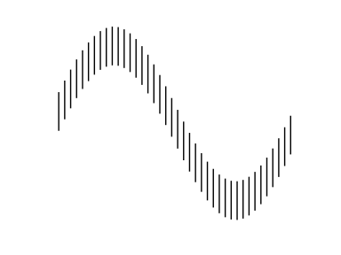

## Sine Illusion - Explained


Perception is optimized for three dimensions.  
Our brains sometimes inappropriately apply 3d heuristics to 2d images, producing optical illusions. 


## Sine Illusion
<table style="border:0px">
<tr style="padding:10px;border:0px;">
<td style="border:0px;vertical-align:middle;align:left;">
- Case Study: DW, an individual who lacks binocular depth perception, is immune to the illusion  
<br>
- Subconscious (can't be "un-seen")  
<br>
- Affects perception of variability or height
    - Candlestick plots (finance)
    - Time Series
    - Scatter plots (nonlinear trend)
    - Streamgraphs
    - Stacked area plots
</td>
<td style="border:0px;vertical-align:middle;text-align:center;">
<p style="font-size:50%">
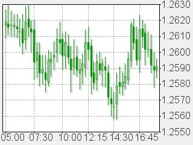<br style="margin:0px;padding:0px;">[Source](https://en.wikipedia.org/wiki/File:Candlestick-chart.png)
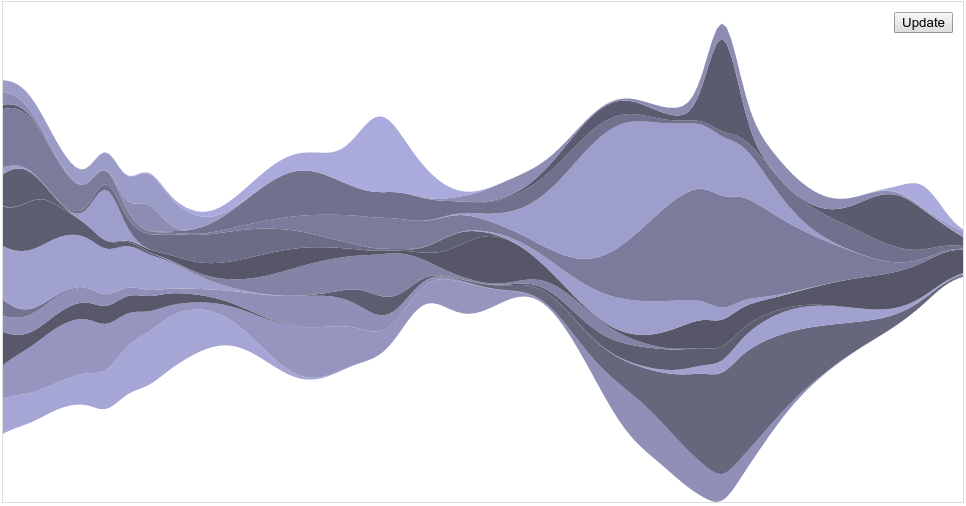 <br style="margin:0px;padding:0px;">[Source](http://bl.ocks.org/mbostock/4060954)
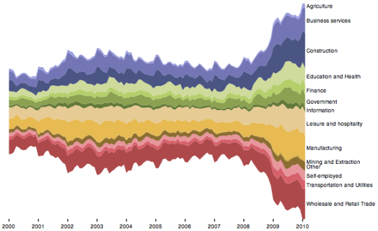 <br style="margin:0px;padding:0px;">[Source](http://homes.cs.washington.edu/~jheer/files/zoo/stacked_graph.png)
</p>
</td>
</table>


## Solution 1: Transform X

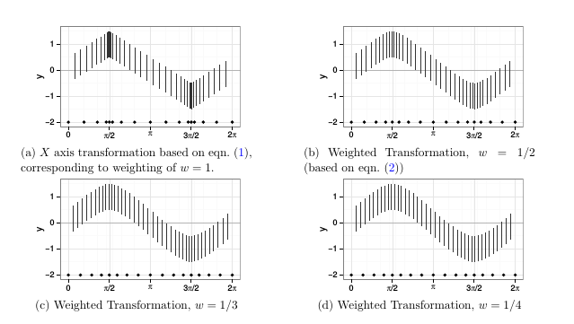  
<p style="font-size:50%">From: [Signs of the Sine Illusion: Why we need to care](http://amstat.tandfonline.com/doi/abs/10.1080/10618600.2014.951547) (JCGS, 2015) </p> 

$(f \circ T)(x) = a + (b-a)\left(\int_{a}^x |f^\prime(z)| dz\right)/\left(\int_{a}^{b}|f^\prime(z)| dz\right)$
$(f \circ T_w)(x) = (1-w) \cdot x + w \cdot (f \circ T)(x)$

## Solution 2: Transform Y

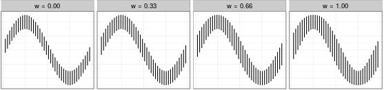  
<small>From: [Signs of the Sine Illusion: Why we need to care](http://amstat.tandfonline.com/doi/abs/10.1080/10618600.2014.951547) (JCGS, 2015) </small> 

$l_{new}(x_0) = l_{old} \sqrt{1 +  f^\prime(x_0)^2}$
$l_{new_w}(x) = (1-w) \cdot l_{old} + w \cdot l_{new}(x)$

## Experimental Validation
<br>
<table style="border:0px">
<tr style="padding:10px;border:0px;">
<td style="border:0px;vertical-align:middle;align:left;text-align:center;">
<a href="http://localhost:3838/SineIllusionShiny/">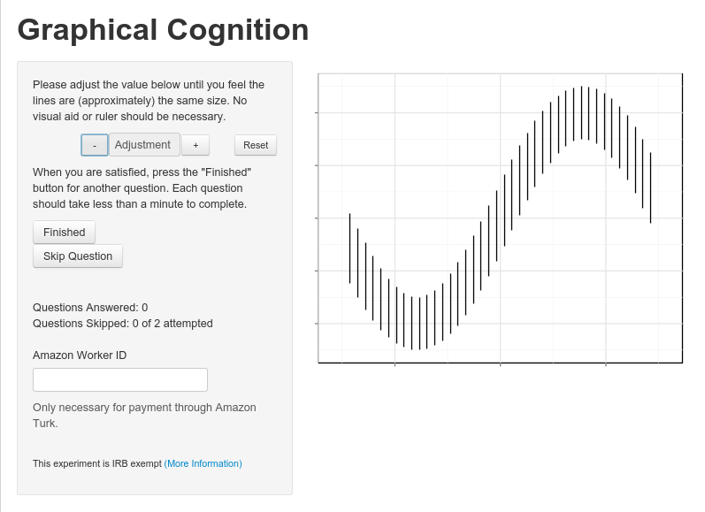</a>
</td>
<td style="border:0px;vertical-align:middle;text-align:center;">
- Corrections validated experimentally  
- Data collected using Amazon Mechanical Turk
- 206 participants completed 1374 trials in 4 days
- Goals: 
    - Identify range of acceptable weight values  
    - Examine whether weight values are specific to individuals or consistent within the population
</td>
</table>


## Results 

<div align="left">
<ul>
<li> Histograms show (bootstrap) estimated parameter values</li>
<li> Lines show individual estimated values </li>
</ul>
</div>

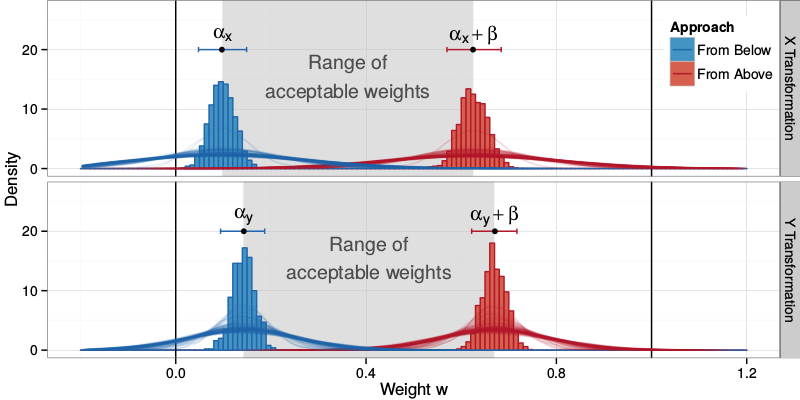  

<div align="left">
<ul>
<li> w=0 and w=1 (fully corrected) are not acceptable weights.</li>
<li> Weight values are similar across correction type and individual </li>
</ul>
</div>


## Findings

- Sine Illusion affects our perception of heteroskedasticity in statistical plots  
<br>
- Corrections are effective at removing the illusion's effects  
<br>
- Partial correction still is effective  
<br>
- "Don't distort the data": We need to be concerned with psychological distortion


## Outline

<br><div align="left">
<ul>
<li style="margin:1em;color:gray;"> Statistical Graphics</li>
<li style="margin:1em;"> Big Data Challenges and Graphics </li>
<li style="margin:1em;"> Case Study: Designing Interactive Graphics for Soybean Population Genetics </li>
<li style="margin:1em;"> Next Steps </li>
</ul>
</div>


# Big Data: Challenges and Graphics {.title}

## Big Data

Visualization is an important tool for working with big data  
<br></br>

Adaptations must be made:  

- Overplotting (large $n$)
- High-dimensional data (large $p$)
- Distributed/multi-source data, hierarchical data
- No solution (binning, dimension reduction, tours) works for every situation

## Interactive Graphics  
  
- Provide additional information in response to user action  
<br>
- Simultaneously show more than 2-3 variables and their relationship (multiple linked plots)  
<br>
- Accommodate complex data structures  
<br>

BUT...  
<br>  
Web-based interactive graphics may be even more size-sensitive than static graphics. 


# Interactive Visualization of Soybean Population Genetic Data {.title}

---


---

## Overall Project Goals: 
- Understand historical yield increases  
<small>100% increase in past 100 years; additional 70% increase by 2050 to meet food needs (World Bank)</small>  
- Associate genetic features with phenotypic traits 
<small>Disease resistance, yield, nutritional content, time to maturity</small>  

- Communicate analysis results intuitively:
    - Target: Soybean farmers, plant geneticists
    - Provide full results (tables) and graphical summaries
    - Interface with existing databases and web resources

## Data
<br>  

- Sequencing Data (79 varieties, 75GB processed and compressed)  
  <br>
- Field Trials (168 varieties, 30 varieties with genetic data)  
  <br>
- New crosses with highest yield varieties  
<small>(sequencing + field trials)</small>  
  <br>
- Genealogy as reported in the breeding literature (1600 varieties)  

## Visualizing SNPs:  
<ul>
<li class="fragment" style="margin:.5em"> Huge number of interesting genes (70 million ID'd SNPs)  
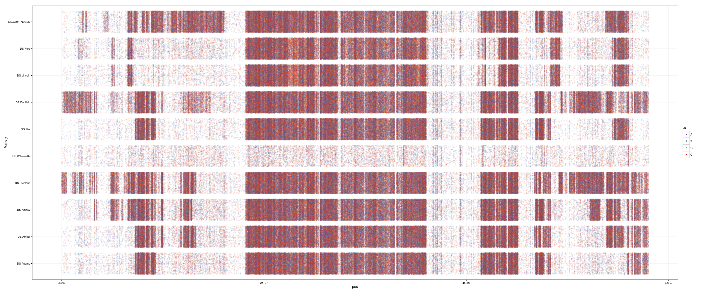</li>
</ul>

## Visualizing SNPs:  
<ul>
<li style="margin:.5em"> Huge number of interesting genes (70 million ID'd SNPs)</li>
<li style="margin:.5em"> 79 varieties, 20 chromosomes</li>
<li class="fragment" style="margin:.5em"> Phenotype and genealogy information</li>
<li class="fragment" style="margin:.5em"> Researchers tend to work on gene subsets:<br>
Must be able to zoom and filter</li>
<li class="fragment" style="margin:.5em"> Optimized files for SNP results are still large (10 GB) and require significant computational resources</li>
</ul>  

<p class="fragment" style="margin-top:1em;">Above all, need an interface to allow people to pull new discoveries from the data systematically. </p>


## Visualizing SNPs

<ul>
<li style="margin:.5em"> SNP: Single Nucleotide Polymorphism, a single basepair mutation  
(A -> T, G -> A, C -> G)</li>
<li class="fragment" style="margin:.5em"> [Shiny](www.shiny.rstudio.com) applet: Responsive applet for user-directed data subsets</li>
<li class="fragment" style="margin:.5em"> Show multiple levels of detail (less detail = lower computational load)</li>
<li class="fragment" style="margin:.5em"> Provide resources in the applet for user exploration (not just a reference tool)</li>
</ul>

## Applet Design

<a href="http://localhost:3838/SNP/">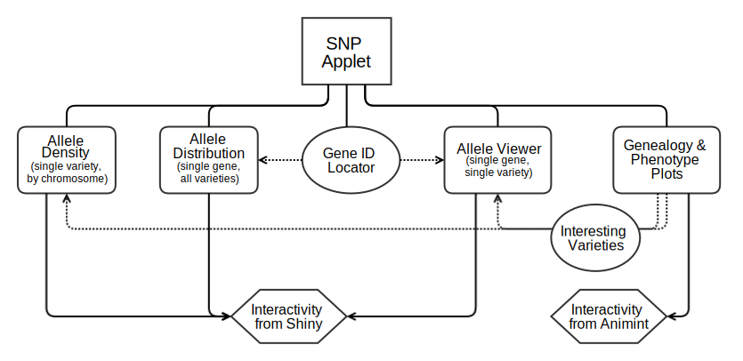</a>

---

### SNP Population Distribution 

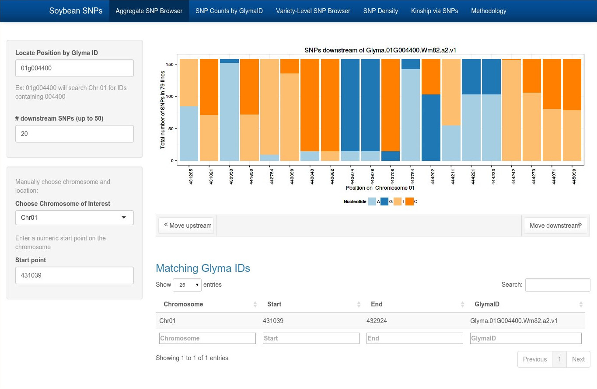

---

### Density of SNPs: Chromosome Level

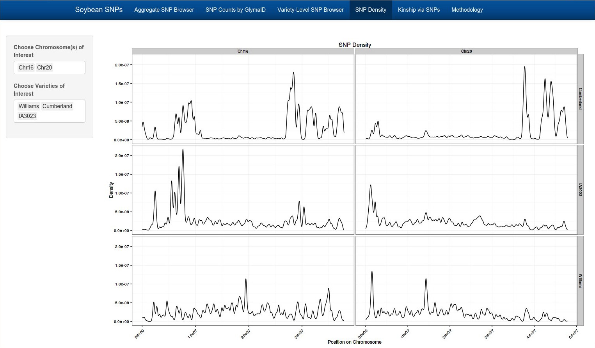

---

### Individual SNPs: Comparing Varieties

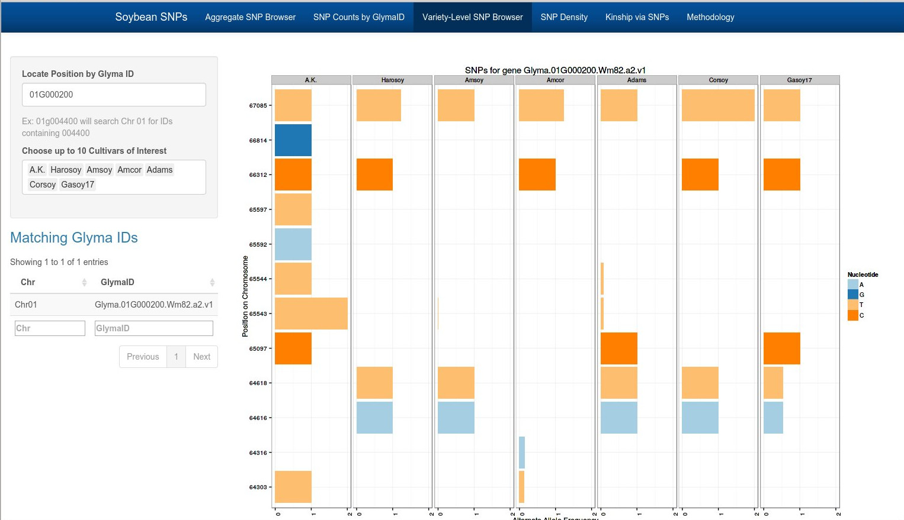

---

### Genealogy and Phenotypes

<a href="/storage/Rprojects/USDAsoybeans/Shiny/SNP/www/animint/index.html">Link</a>

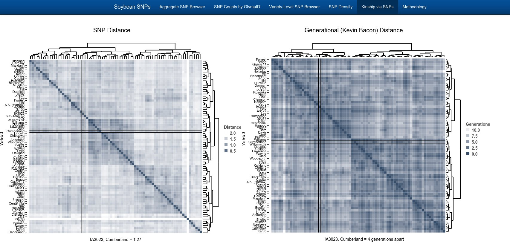


---

## Interactive Plot Design

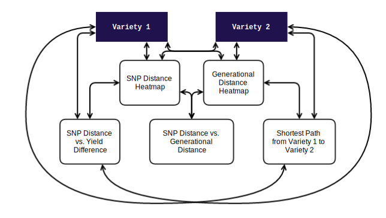

## Good Statistical Graphics

<div style="color:#808080;text-align:left;margin-left:20%;">

**Function:**  

- Show the data
- Don't distort the data  
<br>  

**Form:**  

- Show a consistent story
- Provide several levels of detail
</div><div style="text-align:left;margin-left:20%;">

<div align="center" style="padding:10px">(Ideally)</div>  

**Elegance:**  
How do I best communicate the data?  

- Perceptual Awareness
- Visual Bandwidth (information overload)
</div>
 

## Outline

<br><div align="left">
<ul>
<li style="margin:1em;color:gray;"> Statistical Graphics</li>
<li style="margin:1em;color:gray;"> Big Data Challenges and Graphics </li>
<li style="margin:1em;color:gray;"> Case Study: Designing Interactive Graphics for Soybean Population Genetics </li>
<li style="margin:1em;"> Next Steps </li>
</ul>
</div>

# Conclusions {.title}

<!---
## Next Steps

<ul>
<li style="margin:1em"> Features of "good" graphics</li>
<li style="margin:1em"> Design principles for human perception </li>
<li style="margin:1em"> Transition, animation, and motion effects </li>
<li style="margin:1em"> Types of interactivity that are effective </li>
<li style="margin:1em"> Limits of visual bandwidth and working memory </li>
</ul>
--->

## Next Steps
- User Studies of Interactive Graphics
    - Eye Tracking
    - Click Recording
    - Content Questions
    - "At what point do humans get overloaded?"  
    <br>
    
- Grammar of Interactive Graphics

- Color Perception for Statistical Plots
    - [Colorbrewer](http://colorbrewer2.org/) palettes for maps
    - [dichromat](http://cran.r-project.org/web/packages/dichromat/index.html) R package to simulate colorblindness
    - Need for validated color schemes that work well for scatterplots, bar charts, and other statistical plots  
    <br>

- Hierarchy of Visual Features

---

Goal: Understand which features are most visually important.  
<br></br>  

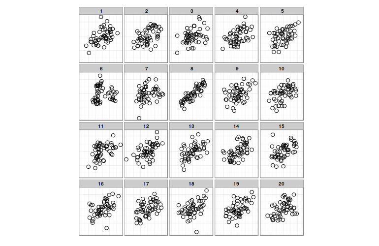

---

Goal: Understand which features are most visually important.  
<br></br>  

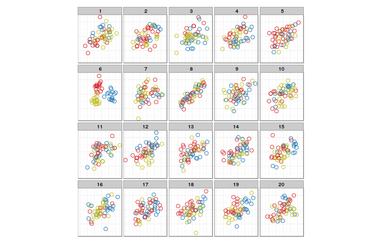


## Other Projects

- [Animint](https://github.com/tdhock/animint) - Extends the ggplot2 implementation of the grammar of graphics to interactive plots  
<br>
- USDA Soybean Population Genetics Research
    - Analysis of copy-number variants
    - Genome-wide association studies of identified SNPs
    - Genealogy database  
<br>
- Data Aggregation
    - Craigslist ads
    - OkCupid
    - Location-based energy prices

## Summary

<ul>
<li style="margin:1em">  Visualization research is inherently interdisciplinary</li>
<li style="margin:1em">  Statistical graphics makes unique contributions to visualizing variation in data</li>
<li style="margin:1em">  Statistical graphics will evolve to address new big data challenges</li>
<li style="margin:1em">  Need to <u>quantify</u> perception to better evaluate graphs</li>
</ul>

---

---

## Acknowledgements 

### Computation
- dplyr/plyr
- reshape2/tidyr
- CN.MOPS: CNV identification in populations of genetic data

## Acknowledgements 

### Visualization Software
- ggplot2
- Animint  
<small>d3 interactive web graphics using ggplot2 syntax in R</small>
- Shiny (RStudio) interactive web applets
- Reveal.js (slides) with Rmarkdown and knitr

## Acknowledgements 

### People
- Heike Hofmann
- Di Cook
- Michelle Graham
- Lindsay Rutter


# Other Research {.title}

## Visual Reasoning

<table style="border:0px">
<tr style="padding:10px;border:0px;">
<td width='50%' style="border:0px;vertical-align:middle;align:left;">
- Graphics research often uses the _lineup protocol_, a hypothesis test analogue for static graphics.  
<br></br>
- Goal: Understand correlation between graphical perception, lineup performance, mathematical reasoning, and classification skill.
</td>
<td width='50%' style="border:0px;vertical-align:middle;text-align:center;">
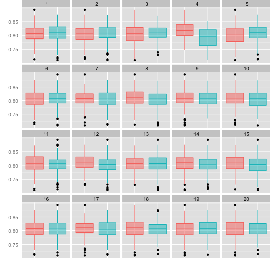
</td>
</table>


## Visual Reasoning

Conclusion: Lineups are an inductive classification task using graphics; performance is not seriously impacted by spatial ability (outside of general aptitude).   
<br>


## Graphical Features

Goal: Understand which features are most visually important.  
<br></br>  


## Graphical Features

Goal: Understand which features are most visually important.  
<br></br>  


