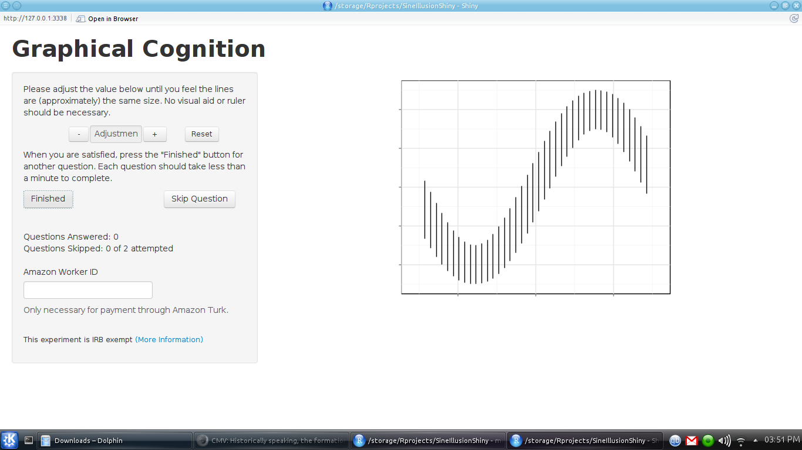

# It's So Shiny!

- RStudio package to write interactive web applets in R     
 
- Extremely simple to set up applets that can be used for data collection     
 
- Paired with other packages (gridSVG, animint, ggvis), could be used to allow direct interaction with graphs     
 
- User interactions can be recorded to a database for analysis

# Using Shiny to Get Data

# Using Shiny to Get Data

- Users can adjust the graphic until it looks "right"     
 
- Time stamps are collected along with graph parameters, window resolution, etc.     
 
- Additional javascript extensions provide user data (IP Address and corresponding geolocation) and a "fingerprint" composed of browser characteristics, screen resolution, etc. hashed for user privacy     
 
- Backend: MySQL database; each user interaction results in a new entry     

# Advantages of Web Applets for Useability Studies

- Wider population for testing (the entire internet vs. undergraduates)     
 
- Easier scheduling     
 
- Data is available faster (users do the data entry themselves)     
 
- Services like Amazon Turk make it easier to get reliable users

# Disadvantages

- Users may not be statistically literate or familiar with statistical graphics     
 
- Verification questions (or other data controls) are essential to ensure participants are taking the task seriously     
 
- Some users have multiple accounts, others are malicious     
 
- Studies are vulnerable to network issues or software bugs     
 
- Greater variability in computer hardware may cause unpredictable bugs (differences in screen resolution, Mac vs. PC, Internet Explorer vs. Chrome/Firefox)

