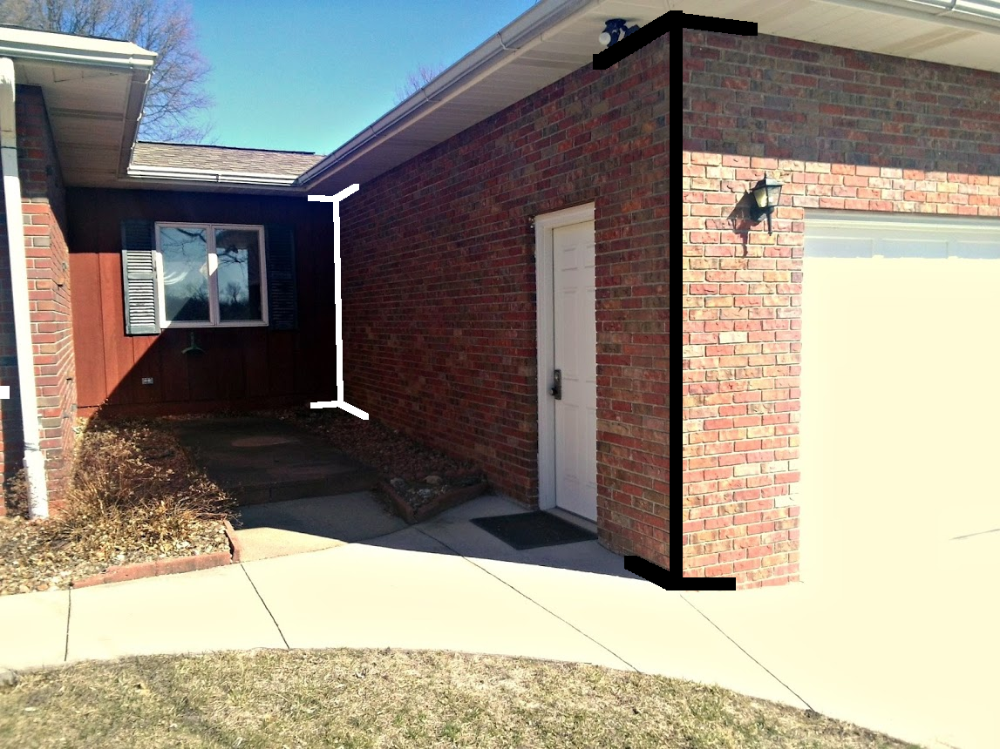
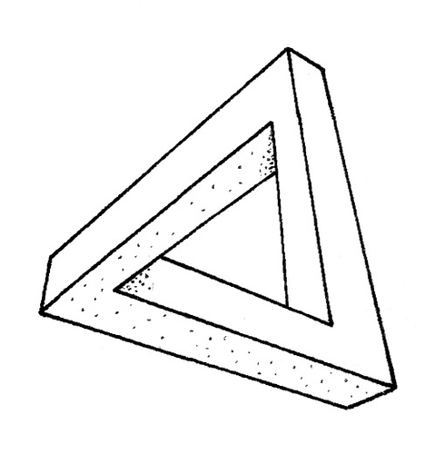
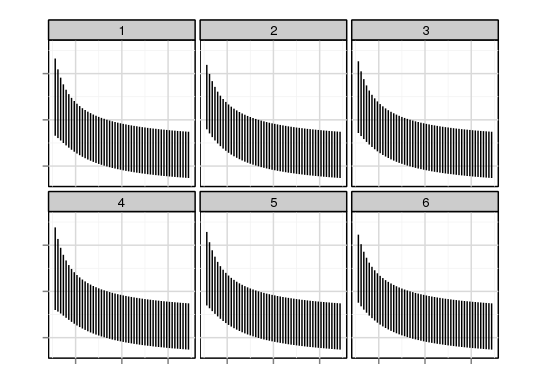
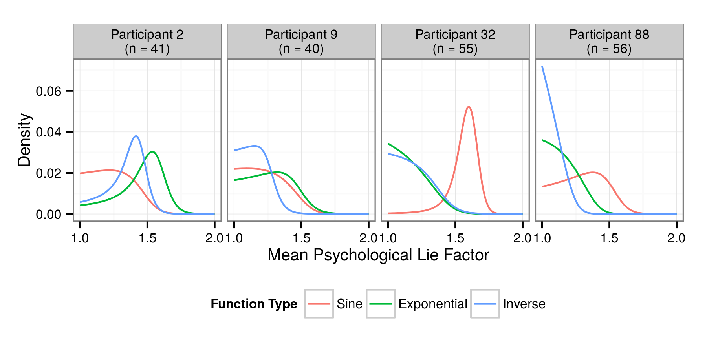
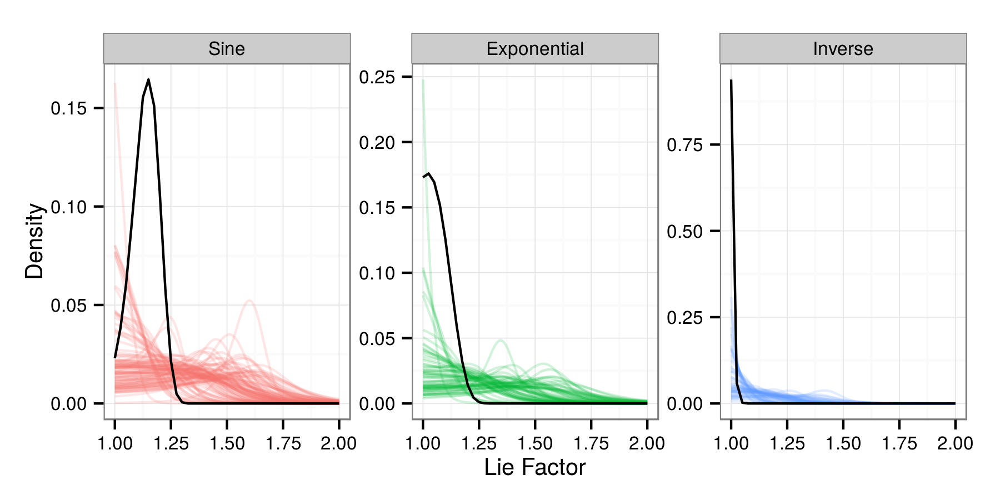
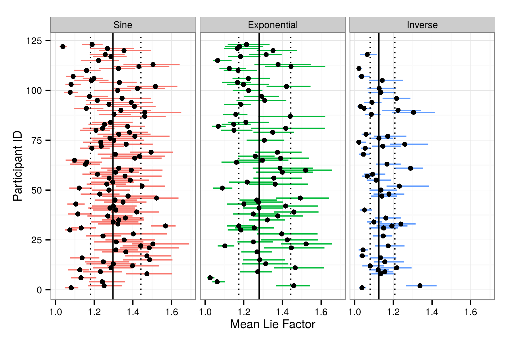

```{r setup, fig.keep='all',echo=FALSE, eval=TRUE, error=FALSE, warning=FALSE, message=FALSE}
options(replace.assign=TRUE,width=70)
library(knitr)
library(ggplot2)
library(reshape2)
library(plyr)
library(gridExtra)

opts_chunk$set(fig.path='figure/fig-', cache.path='cache/', fig.align='center', fig.width=5, fig.height=5, fig.show='hold', par=TRUE, cache=TRUE, concordance=TRUE, autodep=TRUE, warning=FALSE, message=FALSE, echo=FALSE)
source("./code/themeStimuli.R")
source("./code/BayesAnalysis.R") # generate pics for analysis without all the ddplying....
```

## Outline
<div align="left">
### Biology
<small>Why evolution doesn't prefer statisticians</small>
</div>
<br></br>
<div  align="left">
### The Sine Illusion 
<small>Three Dimensions? Or Two?</small>
</div>
<br></br>
<div  align="left">
### Statistical Graphics
<small>Quantifying the brain-paper divide experimentally</small>
</div>
<br></br>
<div align="left">
### Conclusions
<small>Knowing is half the battle</small>
</div>


# Biology {.title}


## Perception is three-dimensional


<small>The brain is optimized for three dimensional perception. This makes sense, because it is very important to perceive three dimensions in order to establish how fast you have to run to escape being eaten. For instance, in the picture shown, no one has any doubt that the corners of my house are about the same length, even though the size of the vertical lines is extremely different </small>


## Perception is three-dimensional

### Graphics are two-dimensional
```{r mullerlyer, echo=FALSE, fig.width=2, fig.height=2, out.width='35%', warning=FALSE, message=FALSE}
y.a <- .125
x.a <- .375

data <- rbind(
        data.frame(x=c(.5, .5, .5-x.a, .5, .5+x.a, .5-x.a, .5, .5+x.a), 
                   y=c(0, 1, -y.a, 0, -y.a, 1+y.a, 1, 1+y.a), 
                   group=c(4, 4, 5, 5, 5, 6, 6, 6), label="A"),
        data.frame(x=c(.5, .5, .5-x.a, .5, .5+x.a, .5-x.a, .5, .5+x.a), 
                   y=c(0, 1, y.a, 0, y.a, 1-y.a, 1, 1-y.a), 
                   group=c(1, 1, 2, 2, 2, 3, 3, 3), label="B"))
qplot(data=data, x=x, y=y, group=group, geom="path") + facet_grid(.~label) + 
  theme(panel.grid.major=element_blank(), panel.background = element_rect(fill = "white", colour = "white"),
        panel.grid.minor=element_blank(), panel.background=element_blank(),
        axis.title = element_blank(), axis.ticks = element_blank(), 
        axis.text = element_blank(), text=element_text(size=10)) + xlim(c(0,1))
```

<small>This illusion is the Muller-Lyer illusion: The vertical line in "A" appears to be longer than the line in "B", even though the segments are the same length. This is because we see image "A" in perspective as an interior corner of a three-dimensional object (which implies it would be further away than "B"). Since they are the same size in the image, "A" must be bigger than "B" taking perspective into account. </small>


## Perception is three-dimensional



<small> The lines drawn onto the image above show the real-world context for this effect; the relative size of the two corners of the house make sense in context, but when the three-dimensional context is removed in an artificial two-dimensional setting, the illusion appears. There are many situations where three-dimensional perception conflicts with artifical two-dimensional graphics; our brain is not entirely trustworthy when we are dealing with synthetic images. </small> 

## Ambiguous Figures
<br></br>
```{r neckercube, fig.width=6, fig.height=2.2, out.width='90%', warning=FALSE, message=FALSE, echo=FALSE}
data <- rbind(data.frame(x=c(0, 1, 1.5, 1.5, 0.5, 0, 0), y=c(0, 0, 0.25, 1.25, 1.25, 1, 0), group=1, line=1),
              data.frame(x=c(0, .5, 1.5), y=c(0, .25, .25), group=2, line=2), 
              data.frame(x=c(.5, .5), y=c(.25, 1.25), group=3, line=2),
              data.frame(x=c(0,  1, 1.5), y=c(1, 1, 1.25), group=4, line=3),
              data.frame(x=c(1, 1), y=c(1, 0), group=5, line=3))

data <- rbind(cbind(data, label="Necker Cube"), cbind(data, label="Interpretation 1"), cbind(data, label="Interpretation 2"))
data$line[data$label=="Necker Cube"] <- 1
data$line[data$label=="Interpretation 2" & data$line==2] <- 1
data$line[data$label=="Interpretation 1" & data$line==3] <- 1
qplot(data=data, x=x, y=y, group=group, geom="path", linetype=factor(line), colour=factor(line)) + facet_grid(.~label) + scale_linetype_discrete(guide="none") + scale_colour_manual(guide="none", values=c("black", "grey40", "grey40")) + 
  theme(panel.grid.major=element_blank(), panel.background = element_rect(fill = "white", colour = "white"),
        panel.grid.minor=element_blank(), panel.background=element_blank(),
        axis.title = element_blank(), axis.ticks = element_blank(), 
        axis.text = element_blank(), text=element_text(size=10))
```

<small> Necker cubes are another situation where there is some ambiguity in mapping the three-dimensional world back into two dimensions. A wire-frame cube as shown in the left-most image can be interpreted in two different ways, shown in the other panels. When looking at the necker cube, it will often "flip" back and forth between the two interpretations; the brain interprets the ambiguous image but cannot decide what three-dimensional object would give rise to the image on the retina. </small> 


## Artistic Trickery




<small> These images show other ways the brain mis-interprets two-dimensional stimuli as three-dimensional objects. The elephant appears normal (but look at the legs!), and the triangle seems perfectly fine until you look closer and realize that it is an "impossible object" that has no obvious three-dimensional interpretation. Next, we will examine one example of the disconnect between two and three-dimensional perception, looking at an illusion that occurs frequently in statistical graphics.  </small>


# The Sine Illusion  {.title}


---

## The Sine Illusion

```{r sineillusion,fig.width=4, fig.height=3, out.width='70%'}

createSine <- function(n=200, len=1, f=f, fprime=fprime, f2prime=f2prime, a=0, b=2*pi) {
  x <- seq(a, b, length=n+2)[(2:(n+1))]
  ell <- rep(len, length=length(x))
  fx <- f(x)
  ystart <- fx - .5*ell
  yend <- fx + .5*ell
  
  # now correct for line illusion in vertical direction
  dy <- diff(range(fx))
  dx <- diff(range(x))
  # fprime works in framework of dx and dy, but we represent it in framework of dx and dy+len
  # needs to be fixed by factor a:  
  a <- dy/(dy + len) 
  # ellx is based on the "trig" correction
  ellx <- ell / cos(atan(abs(a*fprime(x))))
  # ellx2 is based on linear approximation of f  
  ellx2 <- ell * sqrt(1 + a^2*fprime(x)^2)
  
  # make this a data frame - ggplot2 doesn't do well with floating vectors
  dframe <- data.frame(x=x, xstart=x, xend=x, y=fx, ystart=ystart, yend=yend, ell=ell, ellx = ellx, ellx2=ellx2)
  
  # third adjustment is based on quadratic approximation of f.
  # this needs two parts: correction above and below f(x)  
  
  fp <- a*fprime(x)
  f2p <- a*f2prime(x)
  lambdap <- (sqrt((fp^2+1)^2-f2p*fp^2*ell) + fp^2 + 1)^-1    
  lambdam <- -(sqrt((fp^2+1)^2+f2p*fp^2*ell) + fp^2 + 1)^-1    
  
  
  dframe$ellx4.l <- (4*abs(lambdap)*sqrt(1+fp^2))^-1
  dframe$ellx4.u <- (4*abs(lambdam)*sqrt(1+fp^2))^-1
  
  dframe
}

f <- function(x) 2*sin(x)
fprime <- function(x) 2*cos(x)
f2prime <- function(x) -2*sin(x)

qplot(x=x, xend=xend, y = ystart, yend=yend, geom="segment", data=createSine(40, 1, f=f, fprime=fprime, f2prime), colour=I("black")) +
#   geom_line(aes(x=x, y=ystart), colour="black") + 
#   geom_line(aes(x=x, y=yend), colour="black") + 
  theme(panel.grid.major=element_blank(), panel.background = element_rect(fill = "white", colour = "white"),
        panel.grid.minor=element_blank(), panel.background=element_blank(),
        axis.title = element_blank(), axis.ticks = element_blank(), 
        axis.text = element_blank()) + coord_equal(ratio=1)

```


## The Sine Illusion

<small> The image shown on the previous page is the sine illusion. The lines at the top and bottom of the image seem longer than the lines in the middle of the curve (at the inflection point of the underlying function). In reality, the lines are actually the same length; they appear uneven because the brain interprets this image as three-dimensional. Interestingly enough, it seems that at least one person who does not have binocular depth perception due to a congenital condition is immune to this illusion. This suggests that we are correct in believing that like the Muller-Lyer illusion, the sine illusion is the result of misapplied perceptual heuristics which add a three-dimensional context to the illusion. This context is shown on the next slide </small>


## Three Dimensional Context

```{r sineillusion3d,echo=FALSE,fig.width=8, fig.height=4, out.width='100%'}
x <- seq(0, 2*pi, length=42)[2:41]
data <- do.call("rbind", lapply(seq(-.5, .5, 1), function(i) data.frame(x=x, y=2*sin(x), z=i)))

data.persp <- acast(data, x~z, value.var="y")
x <- sort(unique(data$x))
y <- sort(unique(data$y))
z <- sort(unique(data$z))


linedata <- data.frame(x=c(0, 0, 2*pi, 2*pi), y=c(5, 0, 5, 0), z=seq(-.5, .5, 1))
xline <- linedata$x
yline <- linedata$y
zline <- linedata$z

par.settings <- par()
par(mfrow=c(1, 2), mar=c(0, 0, 0, 0))

p1 <- persp(x, z, data.persp,  xlab="", ylab="", zlab="", theta=0, phi=45, border="black", shade=.35, col="white", xlim=c(-pi/12, 2*pi+pi/12), ylim=c(-1.75, 1.75), scale=FALSE, box=FALSE, expand=3/pi, d=2) # , ltheta=0, lphi=-15
lines(trans3d(x=xline[1:2], y=yline[1:2], z=zline[1:2], p1), lty=2)
lines(trans3d(x=xline[3:4], y=yline[3:4], z=zline[3:4], p1), lty=2)
points(trans3d(x=xline[c(1,3)], y=yline[c(1,3)], z=zline[c(1,3)], p1), pch=2, cex=.75)
text(trans3d(x=pi, y=max(yline), z=0, p1), label="Finite Vanishing Point")


linedata <- data.frame(x=c(0, 0, 2*pi, 2*pi), y=c(4, 0, 4, 0), z=seq(-.5, .5, 1))
xline <- linedata$x
yline <- linedata$y
zline <- linedata$z

p2 <- persp(x, z, data.persp, xlab="", ylab="", zlab="", theta=0, phi=45, border="black", shade=.35, col="white", xlim=c(-pi/12, 2*pi+pi/12), ylim=c(-1.75, 1.75), scale=FALSE, box=FALSE, d=20, expand=3/(pi)) # , ltheta=0, lphi=-15
lines(trans3d(x=xline[1:2], y=yline[1:2], z=zline[1:2], p2), lty=2)
lines(trans3d(x=xline[3:4], y=yline[3:4], z=zline[3:4], p2), lty=2)
points(trans3d(x=xline[c(1,3)], y=yline[c(1,3)], z=zline[c(1,3)], p2), pch=2, cex=.75)
text(trans3d(x=pi, y=max(yline)-.25, z=0, p2), label="Near-infinite Vanishing Point")
```


## Three Dimensional Context

<small> The previous slide shows the three-dimensional context for the illusion; when the vanishing point is close, the illusion slightly resembles the three-dimensional object, but when we move the vanishing point out to infinity, the illusion and the three dimensional context map almost exactly. The way we interpret the "length" of the lines in the illusion makes sense given the 3d context; we would measure the width of a ribbon in three dimensions by looking at the orthogonal distance across the curve, but for the purposes of the statistical graphic, we should be considering the vertical length. While the sine illusion is relatively artificial, we run into this problem in scatterplots and time-series graphs as well. </small> 


## Example: US Gas Prices
<br></br>
```{r gasprices-setup, echo=F, include=F}
library(lubridate)
library(plyr)
library(ggplot2)
library(scales)
library(gridExtra)
library(quantreg)

gasprices <- read.csv("data/GasPrices.csv", stringsAsFactors=F)
gasprices$date <- ymd(gasprices$date)
gasprices$year <- year(gasprices$date)
gasprices <- subset(gasprices, year>=1995)
gasprices$month <- floor_date(gasprices$date, "month")+days(14)
gasprices$season <- c(rep("Winter", 2), rep("Spring", 3), rep("Summer", 3), rep("Fall", 3), "Winter")[month(gasprices$date)]
gasprices$round.year <- ifelse(month(gasprices$date)==12, gasprices$year+1, gasprices$year)
gasprices <- ddply(gasprices, .(round.year, season), transform, season.date=median(date))
gasprices <- ddply(gasprices, .(date), transform, avg=mean(price), sd=sd(price))
monthly <- ddply(gasprices, .(month), summarize, min=min(price), max=max(price), median=median(price), sd=sd(price-avg), var=var(price-avg), sd.avg=sd(avg), price=mean(price), year=year(month[1]))
monthly <- ddply(monthly, .(year), transform, avg.sd=mean(sd))
seasonal <- ddply(gasprices, .(round.year, season), summarize, date=mean(decimal_date(date)), sd=sd(price-avg), var=var(price-avg))

model <- smooth.spline(x=decimal_date(gasprices$date), y=gasprices$price, keep.data=TRUE, nknots=230)

gas <- gasprices[,c("date", "price")]
gas$date <- decimal_date(gas$date)

f <- function(x){as.data.frame(predict(model, x=x))$y}
fprime <- function(x){as.data.frame(predict(model, x=x, deriv=1))$y}
f2prime <- function(x){as.data.frame(predict(model, x=x, deriv=2))$y}

gas$pred <- f(gas$date)
gas.pred <- as.data.frame(predict(model))
gas.full <- gas
gas <- unique(gas[,c(1,3)])

```

```{r gasprices-picture, out.width='100%', fig.width=6.4, fig.height=2.15, dependson='gasprices-setup', fig.cap='US Gas prices from 1995 to 2014 steadily increase over the time frame, with some dramatic short-term changes.'}
ggplot(data=gasprices)  +
  geom_jitter(aes(decimal_date(date), price), data=subset(gasprices, year>=1995), size=I(1), #size=I(1.5), shape=I(1), 
              colour=I("grey40"), alpha=I(.75))+ 
#  geom_line(data=gas.pred, aes(x=x, y=y), inherit.aes=FALSE) + 
  ylab("Price per gallon ($)") + theme_bw()+ xlab("Time")  + geom_point(aes(x=1995, y=0), size=0.1) + theme(plot.margin=unit(c(0.1,0.5,0,0.3), "cm"))
```

<div align="left"><small>[Source: EIA Weekly Retail Gasoline and Diesel Prices](http://www.eia.gov/dnav/pet/pet_pri_gnd_dcus_nus_w.htm)</small></div>

<div align="left"><small> What does the variance structure look like for this data? <br> This picture shows gas prices in the US over nearly 20 years. The large dip in gas prices following the market crash in 2008/2009 seems to be accompanied by reduced variance; several other dramatic price changes also seem to be accompanied by reduced variance. The next slide shows the variance computed for each week of gas prices. </small> </div>


## Example: US Gas Prices
<br></br>
```{r gasprices-sdev, out.width='100%', fig.width=6.4, fig.height=2.15, dependson='gasprices-setup', fig.cap='Standard deviation of daily gas prices between 1995 and 2014. The doubling of the standard deviation over the time frame is masked in the scatterplot of the data'}
ggplot( data=subset(monthly, year(month)>=1995) ) + geom_point(aes(month, sd)) + ylab("Standard deviation")  + xlab("Time")+ theme_bw() + #ggtitle("Standard Deviation of Gas Prices")
  theme(plot.margin=unit(c(0.1,.35,0,0), "cm")) + geom_smooth(aes(month, sd), method="loess", colour="grey") + ylim(c(0,0.17))
```

<small> Due to the change in the average price of gas over time, we miss the gradual increase in variance - the standard deviation almost doubles over the 19 year period. The dips in the mean don't actually affect the variance in the price of gas, but we might miss important information about the variance structure by plotting the data, even though such plots are very important to build and evaluate models. </small>


## Understanding the Illusion

```{r orthogonalwidth, out.width='55%', fig.height=4.5, fig.width=6}

f <- function(x) 2*sin(x)
fprime <- function(x) 2*cos(x)
f2prime <- function(x) -2*sin(x)

data <- data.frame(x=seq(-pi, pi, length.out=100), 
                   y=f(seq(-pi, pi, length.out=100)))

data.top <- data
data.top$y <- data$y+.5
data.top$grp <- 1

data.bottom <- data
data.bottom$y <- data$y-.5
data.bottom$grp <- 2

data <- rbind(data.top, data.bottom)

segment1 <- data.frame(x=0, xend=0, y=.5, yend=-.5, label="Actual")

ix.l <- uniroot(f=function(x){ f(x) +1/2*x - 1/2}, interval=c(0, pi/2))$root
ix.u <- uniroot(f=function(x){ f(x) +1/2*x + 1/2}, interval=c(-pi/2,0))$root
segment2 <- data.frame(x=ix.u, y=f(ix.u) + 1/2, xend=ix.l, yend=f(ix.l) - 1/2, label="Perceived")

segments <- rbind(segment1, segment2)

ggplot(data) + 
  geom_line(aes(x=x, y=y, group=grp)) + 
  geom_segment(data=segments, aes(x=x, y=y, xend=xend, yend=yend, color=label)) + 
  scale_colour_manual("Distance Between Curves", values=c("blue", "red")) + 
  theme_bw() +
  theme(legend.position="top", axis.text=element_blank(), 
        axis.title=element_blank(), axis.ticks=element_blank())+
  coord_equal(ratio=1)

```

We can correct the illusion by increasing the blue line's length until the red line is equal to the actual distance. 
<small> [More Information about the correction](https://github.com/heike/sine-illusion/blob/master/Revision2/SineIllusion-Rearrange.pdf?raw=true) </small>


# How much is your brain lying to you? {.title}
<small>Quantifying the effect of the sine illusion through user testing</small>


---

### Tufte's Lie Factor

<br></br>
$$ \text{Lie Factor} = \frac{\text{Effect Size}_{graphic}}{\text{Effect Size}_{data}} $$

<br></br><br></br>

### Psychological Lie Factor

<br></br>
$$ \text{Lie Factor (Brain)} = \frac{\text{Effect Size}_{perception}}{\text{Effect Size}_{graphic}} $$


## Experiment Goals
- Is the sine illusion a significant factor in reading simple plots?    
<small> Do participants always choose the uncorrected plot with uniform line length?</small>    
<br></br>
- How large is the effect of the sine illusion? Does it depend on the underlying function?        
<br></br>
- Would two individuals have similar psychological lie factors?


## Experimental Design
- Show participants sets of 6 plots with the sine illusion corrected to different degrees (including some overcorrection)    
    - 3 underlying functions: sin(x), exp(x), and 1/x.     
<br></br>
- Participants choose the plot of the 6 shown which has lines that are the most uniform in length    
<br></br>
- Participants had to complete at least 10 trials to be included in the study

## Experimental Design



## Experimental Design {.build}
- Compute the "Psychological Lie factor", $D^\ast$, for the chosen plot     
<div align='center'><small>Uncorrected plot has constant line length of 1, so $D$ is equivalent to the maximum line length in a sub plot</small></div>    
<br></br>
- Normalize the chosen lie factor so that the lowest possible selection corresponds to 1. $$P = \frac{D^\ast}{D_{min}} \;\;\; 1\leq P \leq D^\ast$$    
<div align='center'><small> Some test plots do not contain an uncorrected sub-plot, so we will work with $P$ instead of $D^\ast$ to maintain the scale of Tufte's lie factor </small></div>


## Experimental Design
- Compute the "Psychological Lie factor", $D^\ast$, for the chosen plot     
<br></br>
- Normalize the chosen lie factor so that the lowest possible selection corresponds to 1.     
<br></br>    
<div align=center>`r length(unique(turkdata$ip.id))` participants completed `r nrow(turkdata)` trials      
(`r table(turkdata$test_param)[1]` exponential, `r table(turkdata$test_param)[2]` inverse, and `r table(turkdata$test_param)[3]` sine)</div>

## Model Details 
<br></br>
Hierarchical Bayesian model for $\theta$, the overall lie factor     
<br></br>
- Uniform priors on $1\leq \mu\leq 4$, $.1\leq\sigma\leq 2$    
<br></br>
- $f(\theta | P, \mu, \sigma)\sim \text{Truncated Normal}(\mu, \sigma)$, $\theta>1$

## Results
### 4 individuals who completed the most trials



## Results
### Overall Results



## Results
### Individual and Overall Credible Intervals



# Conclusions {.title}


## Conclusions
- The sine illusion has a significant effect on our perception of simple plots    
<br></br>
- The effect does depend on the function    
<br></br>
- The effect seems to be fairly consistent across individuals, but there is some variance
