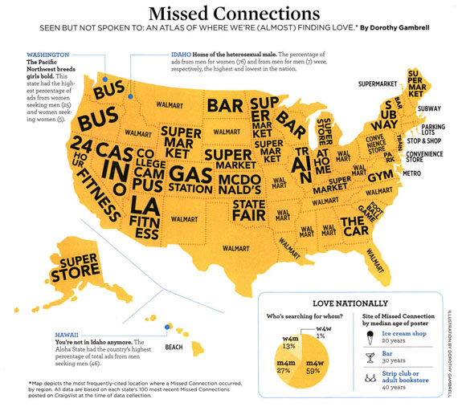

<!----
html_document
--->
<div class="jumbotron"> 
<h1>Mining Classified Ads </h1>

<small>(a.k.a. there are really creepy people on the internet)</small>
</div>

Disclaimer: This post looks at personal ads on online classifieds. These ads are often sexually explicit and crude, and are likely "Not Safe For Work" in all but the most liberal workplaces. 

# Motivation 
This project was inspired by a [Psychology Today article](http://go.galegroup.com/ps/i.do?id=GALE|A315069654&v=2.1&u=lom_kentdl&it=r&inPS=true&prodId=ITOF&userGroupName=lom_kentdl&p=ITOF) which included the following picture: 



I had to wonder... what exactly was going on in Indiana?

# Setup

The data was collected by sampling online personal ads (in English) from random cities in North America at periodic intervals using an R script coupled with a cron job (the frequency of the job changed over time as I tuned the script). Originally, data was written to a MySQL database; the database has been filtered to include only personal ads (of the type one might see [here](http://desmoines.craigslist.org/ppp/)).

```{r setup, message=FALSE, warning=FALSE, echo=-c(1:3), bootstrap.show.code=FALSE}
library(knitr)
opts_chunk$set(fig.align='center', par=TRUE, cache=T, autodep=TRUE, message=FALSE, warning=FALSE, tidy=FALSE, bootstrap.show.code=FALSE)
options(width=120)

library(doMC)
registerDoMC()
library(lubridate)
library(stringr)
library(ggplot2)
library(plyr)
library(dplyr)
```


As this data includes dates and times, we'll use the lubridate package to get these into a more workable format. Similarly, we'll use stringr to manipulate the text of the post more easily. 

# Initial Exploration - Dates, Times, Timezones, and Locations

```{r datesandtimes, message=FALSE, warning=FALSE}
# Read in the data
posts <- read.csv("PersonalAdsPost.csv", row.names=1, stringsAsFactors=FALSE)

# strip timezone information
posts$timezone <- str_sub(posts$post.date, -5, -1)
# posts$post.date2 <- str_sub(posts$post.date, 1, -6)
posts$post.date2 <- posts$post.date
posts$post.date2 <- str_replace(posts$post.date2, "T", " ")
posts$post.date2 <- ymd_hms(posts$post.date2)
posts$post.last.update2 <- str_replace(posts$post.last.update, "T", " ")
posts$post.last.update2 <- ymd_hms(posts$post.last.update)
posts$post.time <- hour(posts$post.date2) + minute(posts$post.date2)/60
posts <- subset(posts, !is.na(post.date2) & !is.na(post.time))
```

Now that we've got workable dates and times, let's plot some basic characteristics of the data. 

```{r clSections, fig.width=10, fig.height=5}
# Relative proportions of posts
posts$post.subcltype2 <- factor(posts$post.subcltype, 
                                levels=c("casual encounters", 
                                         "men seeking men", 
                                         "men seeking women", 
                                         "women seeking men", 
                                         "women seeking women", 
                                         "strictly platonic", 
                                         "miscellaneous romance", 
                                         "missed connections", 
                                         "rants & raves"))
qplot(posts$post.subcltype2) + 
  theme(axis.text.x=element_text(angle=20, hjust=.75)) + 
  xlab("Classified Section") + 
  ylab("Posts") + theme_bw()
```

I was somewhat dissatisfied by the "top 100 posts when the data were collected" explanation in the article (What day was data collected? What time of day? How many days worth of posts were in the top 100, since posts to NYC classifieds are bound to be more numerous than posts to Western Nebraska classifieds?)

In the interests of transparency, here are some basic plots of the "when" of data collection. Times reported are with respect to Central Time, so there are slight discrepancies between Eastern and Pacific time. Lubridate doesn't let you vectorize the time zone argument, though, so this will have to do. 

```{r postsByTimezone, fig.width=10, fig.height=8}
# Posting times, by timezone
posts$timezone2 <- factor(posts$timezone, levels=c("-0500", "-0600", "-0700", "-0800"), labels=c("Eastern", "Central", "Mountain", "Pacific"))
qplot(x=post.time, fill=timezone2, geom="histogram", 
      data=subset(posts, !is.na(timezone2)), binwidth=1) + 
  scale_fill_brewer("Time Zone", palette="Set1") + 
  theme_bw() + 
  facet_grid(timezone2~., scales="free") + 
  scale_x_continuous("Time", limits=c(0, 24), breaks=c(0, 6, 12, 18, 24)) +
  scale_y_continuous("Posts")
```

There are also many fewer posts in the mountain time zone than in other areas. 

```{r postsByDay, fig.width=10, fig.height=5}
# Histogram of post days
qplot(wday(post.date2, label=TRUE, abbr=TRUE), 
      data=subset(posts, !is.na(wday(post.date2)))) + 
  xlab("Day Posted") + ylab("Posts") + theme_bw()
```

Most of the posts were collected on the night of January 14th and 15th (Tuesday and Wednesday, respectively), when I was testing to see how far I could get my script to scale (pretty far, as it turns out; at the end I was scraping 20-30 randomly selected cities every 10 minutes. Duplicate posts were removed, but the bias is still very obvious.)

```{r postsByDate, fig.width=10, fig.height=4}
# Density of posts
qplot(post.date2, geom="density", data=posts) + 
  xlab("Post Date") + 
  ylab("Density") + 
  theme_bw()
```

Data collection was conducted in January, and shortly thereafter I had to do a distribution upgrade on the server and the script was broken afterwards (likely due to formatting changes on the site in question). Once the spring semester started, I didn't have time to fix the script, so we have about 6 weeks worth of data to explore, collected between January 14-15. 

The skewed distribution here is a result of the way the online classified site works: I scraped the top 300 posts from each randomly selected location. In more populated areas, 300 posts might represent activity from a couple of days; in less populated areas, 300 posts might represent an entire month of activity. 

```{r postSpan, fig.width=6, fig.height=10}
post.location <- group_by(posts, cityurl) %>% 
  summarize(min_date=min(post.date2), 
            max_date=max(post.date2))

# remove web address
post.location$city <- str_replace(post.location$cityurl, "http://", "")
post.location$city <- str_replace(post.location$city, "\\.(en\\.)?(\\w*)\\.(org)?(ca)?", "")

posts$city <- str_replace(posts$cityurl, "http://", "")
posts$city <- str_replace(posts$city, "\\.(en\\.)?(\\w*)\\.(org)?(ca)?", "")

qplot(x=min_date, xend=max_date, y=city, yend=city, 
      geom="segment", data=post.location) + 
  xlab("Range of Collected Posts") + ylab("City/Region") + 
  ggtitle("Time Coverage of Classified Ads") + 
  geom_point(data=posts, aes(x=post.date2, y=city), 
             alpha=.2, inherit.aes=FALSE) + theme_bw()
```

When we plot the total number of posts in our database by classified location, we can see that there are between 300 and 600 posts per City/Region. A large city which has many posts that happened to be sampled twice during the process (as I sampled with replacement for this project) might have more than 300 unique posts, where a more rural area which had fewer posts might have only 300 unique posts (fewer if links were broken). 

```{r clPostDistribution, fig.width=6, fig.height=10}
qplot(x=city, geom="histogram", data=posts) + coord_flip() + theme_bw() + xlab("City/Region") + ylab("Posts Collected")
```

I'm currently re-running the sampling script in the hopes that I can get both a longer time-period (on the order of a month or so of data) and more locales. Hopefully, there will be more data (with a more even distribution) in the next few weeks... then we can finally settle this!

# Words, words, words

I'll use the tm package to get a sense of the text in the posts. We'll start by looking at the most common words in the corpus (the collection of all posts). 
```{r textminingsetup}
library(tm)

# need to clean up text before putting it into tm_map...
posts$post.text2 <- str_replace_all(posts$post.text, "[\'\"]", "")
posts$post.text2 <- str_replace_all(posts$post.text2, "[[:punct:]]", " ")
posts$post.text2 <- str_replace_all(posts$post.text2, "\\n", " ")
posts$post.text2 <- str_replace_all(posts$post.text2, "[[:digit:]]", " ")

# create the corpus
myCorpus <- Corpus(VectorSource(posts$post.text2))

dict <- unlist(lapply(tolower(posts$post.text2), strsplit, " "))
dict.table <- table(dict)
dict.table <- dict.table[order(dict.table, decreasing=TRUE)]

# Most common words: 
names(dict.table[1:20])
# conclusion: we need to remove stopwords. 
```

## Frequent Terms

We'll use functions in the tm package to remove stopwords, punctuation, and numbers from the corpus. We will then take the corrected text and make a matrix associating terms with the texts they appear in. 

```{r textminingcorpus}
# transform the content, removing stopwords, numbers, and punctuation
myCorpus <- tm_map(myCorpus, content_transformer(tolower))
myCorpus <- tm_map(myCorpus, content_transformer(removePunctuation))
myCorpus <- tm_map(myCorpus, content_transformer(removeNumbers))
myStopwords <- stopwords('english')
myCorpus <- tm_map(myCorpus, removeWords, myStopwords)

# Create a DocumentTermMatrix 
myDtm <- DocumentTermMatrix(myCorpus, control = list(wordLengths = c(2, Inf)))
findFreqTerms(myDtm, lowfreq=1500) # terms in at least 1500 posts (total)
```

## Word Associations

Now that the document term matrix has been created, we can look at word associations. As these are personal ads, let's see what words are associated with the word "attractive": 
```{r wordassociations-attractive}
findAssocs(myDtm, "attractive", .125)
```
The results are thoroughly confusing. Moving on... what about "single"?
```{r wordassociations-single}
findAssocs(myDtm, "single", .10)
```
"Single" is associated with "married", "orgy", "appriciated" (I presume they meant appreciated), "family", etc. Clearly, association is not the same as synonym. 

Let's try something that should produce a more crude response: words associated with "long". 
```{r wordassociations-long}
findAssocs(myDtm, "long", .15)
```
No surprises there. Or were you thinking dirty already? 

I also wonder if "married" is going to be as confusing as "single"? 
```{r wordassociations-married}
findAssocs(myDtm, "married", .1)
```
Ok, so "married" isn't quite as confusing. 

Personal Ads are known for using abbreviations (even when space isn't restricted, as is the case online). "nsa" stands for "No Strings Attached" - let's see what it's associated with (we won't have the resolution necessary to determine whether it's associated with the National Security Administration). 
```{r wordassociations-nsa}
findAssocs(myDtm, "nsa", .075)
```
Odd; seems that it's associated with "fwb" (friends with benefits) and many words that appear to be concatenated - "earlythree", "andnine", etc.

A few terms chosen to be a bit superficial (weight, appearance, etc.)
```{r wordassociations-lbs}
findAssocs(myDtm, "lbs", .1)
```
Ok, posts with "lbs" also specify appearance. That makes sense. 

Another appearance-related term; its associations will probably not surprise you. 
```{r wordassociations-thick}
findAssocs(myDtm, "thick", .1)
```


## Generating Classified Posts (pictures not included!)
We can use our posts to generate new posts as well. Using n-grams (strings of $n$ words), we can generate new posts that are based on the conditional probability that "this" follows "that". Specifically, if $x$ is a string of $n$ words and $y$ is the $(n+1)$th word, we are modeling $P(y | x)$, that is, the probability that $y$ is next after $x$. So if we're modeling 2-grams, and the last 2 words we read were "Just in", we'd likely consider "case" and "time" to have high probabilities of being the next word. 

The `ngram` package splits our text up into ngrams and then recombines the ngrams to form an entirely new text using the `babble()` function. We'll use the functions in the ngram package to create new craigslist ads. I've added tokens to the beginning and end of each ad, to help differentiate how ads start from where they end. The tokens are structured in such a way that there are several "words" that mark the beginning and end of a post; that way, strings that are not related should be definitively separate even using 6-grams (I think up to using 10-grams, actually). I have not split punctuation from words, so only words which ended sentances in the database of posts will be available to end sentances in the generated text. 

```{r ngrams}
library(ngram)

post.len <- as.numeric(sapply(as.character(posts$post.text), wordcount))


clean.posts <- function(text, space.words=FALSE){
  # Remove web addresses, since the punctuation will get all messed up anyways.
  text <- str_replace_all(text, "http:\\\\[a-zA-Z1-9]{1,}\\.[a-zA-Z]{1,4}", " ")
  # Make parentheses spacing uniform _(_ ..... _)_
  text <- str_replace_all(text, "([\\()])", " \\1 ")
  # Enforce spaces between punctuation but allow for multiple punctuation marks in a row
  text <- str_replace_all(text, "([\\.,\\?!]{1,})", " \\1 ")
  if(space.words){
    text <- str_replace_all(text, " ([\\.,\\?!]{1})", "\\1")
  }
  # Remove all endline characters
  text <- str_replace_all(text, "\\n", " ")
  # replace all incidences of multiple spaces with a single space
  text <- str_replace_all(text, "( ){2,}", " ")
  # Remove all non-ascii characters
  text <- iconv(text, "", "ASCII//TRANSLIT")
  # make all text lower case
  text <- tolower(text)
  
  text
}

# Clean posts and then collapse all posts into a single string where individual posts are marked with special tags
babble.text <- clean.posts(posts$post.text)
babble.text <- paste(" - - - - BEGIN ", babble.text)
babble.text <- paste(" END - - - - ", babble.text)
babble.text <- concat(babble.text, collapse = " ")

# preprocess text
babble.text <- preprocess(babble.text, case=NULL)

# Create 2-grams
ngram.res <- ngram(babble.text, n=2)

# Looking at the object
print(ngram.res)

# Want to ensure complete sentances (not like the originals) and also break ngrams apart by BEGIN and END
fix.babble <- function(text){
  if(length(text)==1){
    if(grepl("(END|BEGIN)", text)){
      gen.posts <- str_trim(str_split(text, "END (- ){1,}BEGIN")[[1]])
      gen.posts <- gen.posts[-c(1,length(gen.posts))]
    } else {
      gen.posts <- str_trim(text)
    }
  } else {
    gen.posts <- str_trim(text)
  }
  fixed <- str_replace_all(gen.posts, " ([\\.,\\?!\\()]{1,}) ", "\\1 ")
  return(fixed)
}

# Function to compare generated posts to original posts
library(plyr)
compare.posts <- function(post){
    ldply(post, function(i) {
    first.words <- str_extract(i, "([[:alnum:]]{1,}[ (\\. )]){6,8}")
    if(is.na(first.words) | length(first.words)==0){
      return(data.frame(generated.post=i, original.match=NA, stringsAsFactors=FALSE))
    }
    match <- which(grepl(first.words, tolower(posts$post.text)))
    if(length(match)>0){
      return(data.frame(generated.post=i, original.match=unique(fix.babble(clean.posts(posts$post.text[match]))), stringsAsFactors=FALSE))
    } else {
      return(data.frame(generated.post=i, original.match=NA, stringsAsFactors=FALSE))
    } 
  })
}

out.posts <- babble(ngram.res, 1000, seed=241205828)
out.posts <- fix.babble(out.posts)
compare <- compare.posts(out.posts)

```

> `r out.posts[1]`

> `r out.posts[2]`

This sounds only slightly more schizophrenic than the typical Craigslist ad. Just for fun, let's ramp up our game and use 3-grams in our model. Conditioning on an extra word should give us more sentance continuity, so that the topic doesn't change back and forth quite so much. 

```{r 3grams}
# Create 3-grams
ngram.res <- ngram(babble.text, n=3)

# Generate a new sequence of 1000 words
out.posts <- fix.babble(babble(ngram.res, 1000, seed=109897276))
compare <- compare.posts(out.posts)
```

> `r out.posts[1]`

> `r out.posts[2]`

These are still quite prone to rambling - the originals are a bit better, at least. We still haven't increased complexity to the point where we're running the risk of duplicating ads from the database - this would occur if we used a larger value for $n$ in our $n$-grams. We aren't even matching the first 6-8 words in any post: of the `r length(out.posts)` posts we generated, we got `r sum(!is.na(compare$original.match))` matches back. 

Just for fun, we'll try something crazy and use 6-grams. This is likely to get us much closer to things that are actually in the classified ads, but 6-grams [have been previously used for this sort of task with some success](http://wuglife.tumblr.com/post/74088955204/lovebible-pl-a-markov-generator-trained-on-h-p) (that link is pretty sweet - King James Bible + HP Lovecraft generated text). 

```{r 6grams}
# Create 6-grams
ngram.res <- ngram(babble.text, n=6)

# Looking at the object
print(ngram.res)

# Generate a new sequence of 500 words
out.posts <- fix.babble(babble(ngram.res, 500, seed=609807796))

compare <- compare.posts(out.posts)
```

Giving 6-grams a try, we get some pretty decent generated classified ads. They're at least as coherent as the source text...

> `r compare$generated.post[1]`

Comparing the first few words of this to real ads gets us 

> `r compare$original.match[1]`

So there is a little mixing of ads, but not too much. 

> `r compare$generated.post[2]`

Searching the database for the first few words provides the same ad in the original database: 

> `r compare$original.match[2]`

So our generator is a bit too specific here (or we need a larger database). 

> `r compare$generated.post[3]`

Again, this post is pretty coherent (or at least, par for the course in this dataset). Checking our database, we find the same ad: 

> `r compare$original.match[3]`

So 6-grams are probably a bit much. Of the `r length(out.posts)` posts that resulted from our 500 word sequence, `r sum(compare$generated.post==compare$original.match, na.rm=TRUE)` of them are nearly verbatim copies of posts in our database. Of course, part of this depends on the length of the post - a short post is going to be much more likely to be verbatim from the database, because there are so few transitions between n-grams. 

Moving backwards a bit, we can examine 4-grams in the same way to see whether they are better. 


```{r 4grams}
# Create 4-grams
ngram.res <- ngram(babble.text, n=4)

# Looking at the object
print(ngram.res)

# Generate a new sequence of 500 words
out.posts <- fix.babble(babble(ngram.res, 1000, seed=90345987))

compare <- compare.posts(out.posts)
```

We're searching our database for the first 6-8 words in the generated post; any matches should contain those words. 
Looking at our results, the first sequence is not too bad - starts off the same, but transitions nicely. 

> `r compare[1,]`

The rest of the `r length(out.posts)` posts that comprise the 1000 word sequence we generated aren't so bad either. 

> `r compare[2,]`

Of the `r length(out.posts)`, `r sum(compare$generated.post==compare$original.match, na.rm=TRUE)` are perfect matches to the database, and `r sum(is.na(compare$original.match), na.rm=TRUE)` don't even match the first 6-8 words! 

## Measuring Dirty Words

### Is there a dictionary for this kind of thing?

Yes, yes, there is. In fact, I think there are many. In an effort to avoid scraping UrbanDictionary, we'll go with the (current) [first search hit](http://cltampa.com/dailyloaf/archives/2012/09/16/dirty-sex-dictionary?showFullText=true) on google for "dirty words dictionary". 

```{r dirtywords, eval=F}
# Scrape Dirty Words list

url <- "http://cltampa.com/dailyloaf/archives/2012/09/16/dirty-sex-dictionary?showFullText=true"

library(scrapeR)
library(stringr)

site <- scrape(url)[[1]]

defs <- tolower(sapply(getNodeSet(site, "//*[@id='BlogsBlogPost']/div[1]/div[2]/p"), xmlValue))
defs <- subset(defs, nchar(defs)>3)
defs <- defs[!grepl("jump to:", defs)]

sex.synonyms <- defs[grepl("sex: ask your mother.", defs)]
defs[grepl("sex: ask your mother.", defs)] <- "sex: ask your mother. apparently she is an expert on the subject."
sex.synonyms <- gsub("sex: ask your mother. apparently she is an expert on the subject. sex.synonyms: ", "", sex.synonyms)
sex.synonyms <- str_split(sex.synonyms, pattern="(([[:alpha:]]|#): )|(, )")[[1]]
sex.synonyms <- sex.synonyms[!grepl(":", sex.synonyms) & nchar(sex.synonyms)>1]
sex.synonyms <- paste0(sex.synonyms, ": sex")

guy.stuff <- gsub("^\\s|(\\.\\.\\.)", "", paste(unlist(str_split(gsub("^[[:alpha:]]:", "", defs[grepl("^[[:alpha:]]:", defs)]), pattern = ", ")), ": male masturbation", sep=""))
defs <- defs[!grepl("^[[:alpha:]]:", defs)]

girl.stuff <- paste0(str_trim(str_split(word(defs[grepl("—female ", defs)], sep=":", 2), ",")[[1]]), ": ", "female masturbation")
defs <- defs[!grepl("—female ", defs)]


problem.entries <- subset(defs, str_count(defs, ":")>1)

# Fix entries with synonyms at the end by repeating the definition and adding a new line for each synonym. (Not perfect, but it'll do)
synonyms <- problem.entries[grepl("(synonym(s)?(y)?:)|(variation(s)?:)|(related to:)|(similar( to)?:)|(also:)", problem.entries)]
problem.entries <- problem.entries[!grepl("(synonym(s)?(y)?:)|(variation(s)?:)|(related to:)|(similar( to)?:)|(also:)", problem.entries)]

term <- str_split(word(synonyms, sep="(synonym(s)?(y)?:)|(variation(s)?:)|(related to:)|(similar( to)?:)|(also:)", start=-1), ",")
term.def <- str_replace(word(synonyms, sep=":", 2), "(synonym(s)?(y)?)|(variation(s)?)|(related to)|(similar( to)?)|(also)", "")
synonyms.fixed <- gsub("\\.:", ":", unlist(lapply(1:length(term), function(i) paste0(str_replace(unlist(term[i]), "^(\\s)+|\\.$", ""), ":", term.def[i]))))
synonyms.fixed <- synonyms.fixed[!grepl("^:", synonyms.fixed)]
synonyms.fixed <- gsub(":$", "", synonyms.fixed)
rm(term, term.def)

# Remove "origins" at the end of definition
origins <- problem.entries[grepl("origins:", problem.entries)]
origins <- word(origins, sep="origin")
problem.entries <- problem.entries[!grepl("origins:", problem.entries)]

# Remove other addenda
problem.entries <- word(problem.entries, sep="usage:")
problem.entries <- word(problem.entries, sep="antonym(s)?:")
problem.entries <- word(problem.entries, sep="pop-culture reference(s)?:")
problem.entries <- word(problem.entries, sep="quote:")
problem.entries <- word(problem.entries, sep="see:")
problem.entries <- word(problem.entries, sep=": see")
problem.entries <- word(problem.entries, sep="history: ")

# Split definitions that aren't separated
notseparated <- problem.entries[grepl("\\.\\w*( \\w*)?:", problem.entries)]
problem.entries <- problem.entries[!grepl("\\.\\w*( \\w*)?:", problem.entries)]

notseparated <- c(word(notseparated, sep="\\.\\w*( \\w*)?:"), gsub("^\\.", "", str_extract(notseparated, "\\.\\w*( \\w*)?:.*$")))

defs2 <- c(defs, synonyms, synonyms.fixed, sex.synonyms, girl.stuff, guy.stuff, origins, problem.entries)
rm(notseparated, problem.entries, origins, synonyms.fixed, synonyms, defs, sex.synonyms, girl.stuff, guy.stuff)

df <- data.frame(word = word(defs2, sep=":", 1))
df$definition <- str_replace(defs2, paste0(df$word, ":"), "")

```

We can then use this dictionary (or at least, the list of words and phrases) and look for occurrences in our document matrix. 

```{r dictionarySearch, eval=F}
library(slam)
myTerms <- str_trim(gsub("[[:punct:]]", " ", gsub(",", " ", gsub("//", " ", tolower(df$word)))))
dirtyDTM <- DocumentTermMatrix(myCorpus, control = list(wordLengths = c(2, Inf), dictionary=myTerms))

# keep only words that occurred at least 15 times in the corpus
dirtyDTM <- dirtyDTM[,which(col_sums(dirtyDTM)>=15)]
```

<!----
## Topic Modeling
We'll use the mallet package and LDAvis to try to model the various topics in Craigslist personal ads. I'm following the [LDAvis documentation](https://cpsievert.github.io/LDAvis/reviews/reviews.html) and examples (written by the most awesome Carson Sievert) to complete this step. 

```{r malletLDAvis, eval=F, include=F}
# Download stopwords
download.file("http://jmlr.org/papers/volume5/lewis04a/a11-smart-stop-list/english.stop", "stopwords.txt")
library(mallet)
instance <- mallet.import(as.character(posts$post.title), as.character(posts$post.text), "stopwords.txt")

# Start with 9 topics, since there are 9 categories to post in
model <- MalletLDA(num.topics=9)
model$loadDocuments(instance)
freqs <- mallet.word.freqs(model)

# Fitting/training the model
model$train(2000)
# Compute the topic-term distribution (smoothed=TRUE includes prior's effect)
phi <- t(mallet.topic.words(model, smoothed = TRUE, normalized = TRUE))
phi.count <- t(mallet.topic.words(model, smoothed = TRUE, normalized = FALSE))
topic.words <- mallet.topic.words(model, smoothed = TRUE, normalized = FALSE)
topic.counts <- rowSums(topic.words)
topic.proportions <- topic.counts/sum(topic.counts)
vocab <- model$getVocabulary()

library(LDAvis)
out <- check.inputs(K = 25, W = length(vocab), phi = phi, 
                    term.frequency = apply(phi.count, 1, sum), 
                    vocab = vocab, topic.proportion = topic.proportions)
# Relabel topics so that topics are numbered in decreasing order of frequency.
colnames(out$phi) <- seq_len(out$K)

# Create json file
json <- with(out, createJSON(K = 25, phi, term.frequency, 
                   vocab, topic.proportion))

# Create visualization

serVis(json, out.dir = 'vis', open.browser = FALSE)
```

 <iframe src = "vis/index.html" width=900 height=700></iframe>
--->